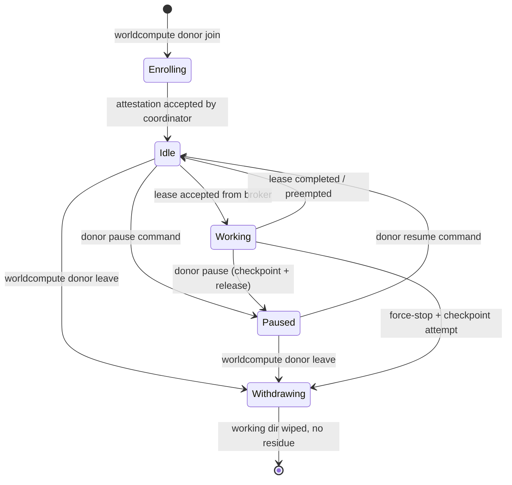
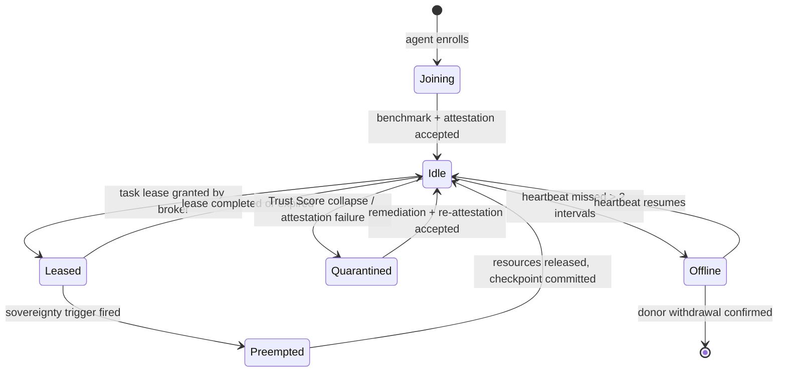
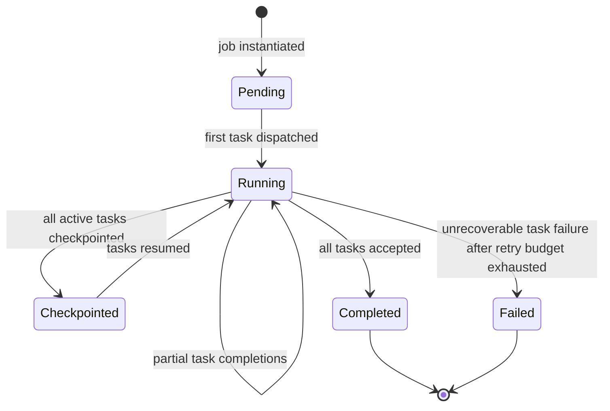
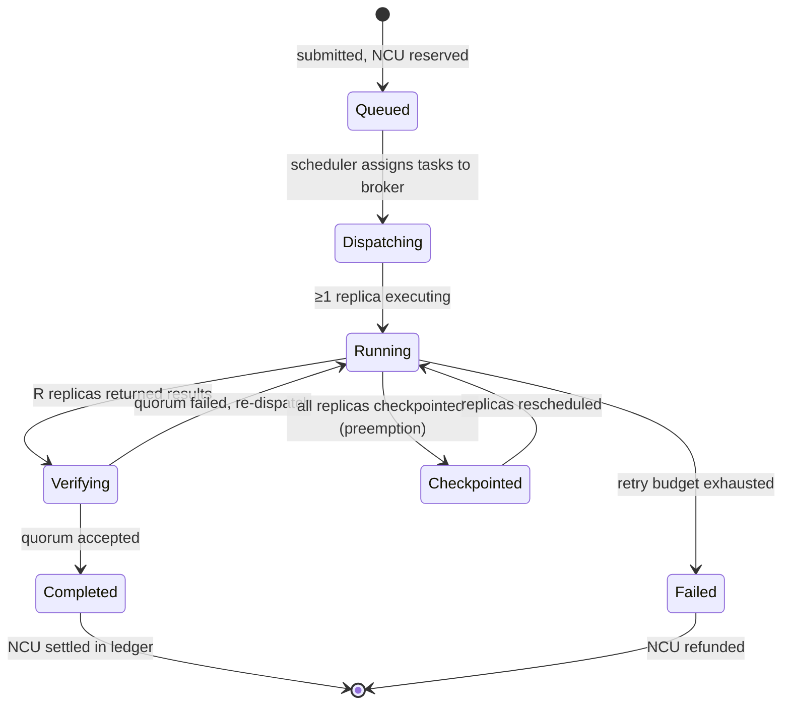
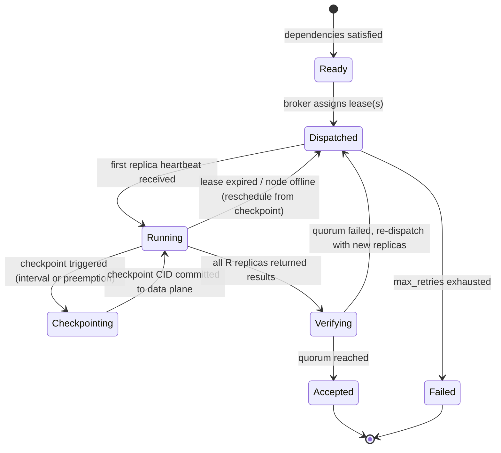
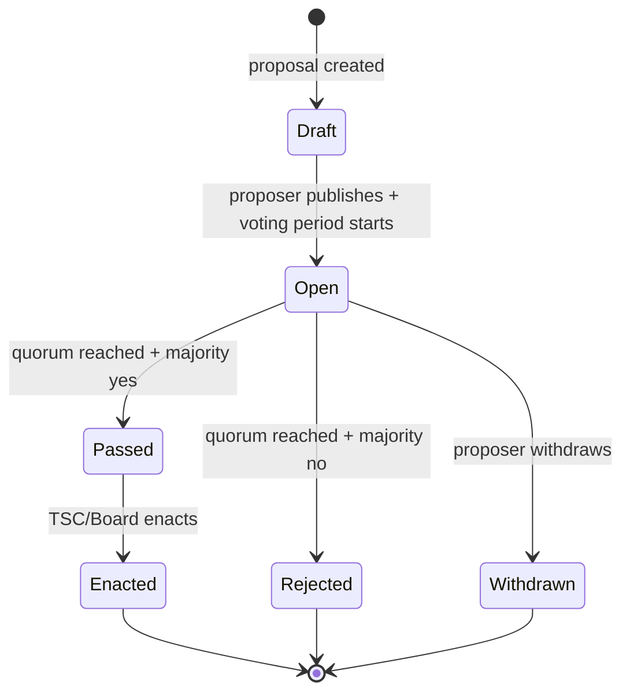

# World Compute v1 — Data Model

**Document type**: Canonical entity model (schema-level design reference)
**Spec**: `001-world-compute-core`
**Version**: 0.1.0-draft
**Date**: 2026-04-15
**Status**: Draft — pending TSC review

---

## 1. Purpose

This document is the canonical entity model for World Compute v1. It defines every first-class entity the system manages: its fields, types, identity scheme, relationships to other entities, invariants that must hold at all times, and state transitions where applicable. It is the bridge between the functional requirements in `spec.md` and the implementation artifacts (Rust structs, protobuf message definitions, storage schemas). It is **not** a wire-format specification, not a SQL DDL, and not a protobuf source file — those are derived from this document, not the other way around. Wherever a field is annotated with a FR number, that requirement is the normative source; this document provides the structural home for it.

---

## 2. Conventions

### Type notation

| Notation | Meaning |
|-|-|
| `u8`, `u16`, `u32`, `u64` | Unsigned integers, little-endian on wire |
| `i64` | Signed 64-bit integer |
| `bool` | Single boolean |
| `String` | UTF-8 string, length-prefixed on wire |
| `Cid` | Content identifier — see Type Reference §8 |
| `PeerId` | Ed25519 public-key hash — see §8 |
| `NcuAmount` | Micro-NCU quantity as `u64` — see §8 |
| `Timestamp` | Unix microseconds as `i64` — see §8 |
| `DurationMs` | Duration in milliseconds as `u64` |
| `TrustScore` | Fixed-point 0–1 as `u32` in units of 1/1,000,000 — see §8 |
| `SignatureBundle` | Threshold signature — see §8 |
| `AttestationQuote` | TPM/SEV/TDX/soft attestation blob — see §8 |
| `[T]` | Variable-length list of `T` |
| `Option<T>` | Optional field; absent means the feature or value is not set |
| `Map<K,V>` | Key-value map |

### Enums

Enums are listed as `Variant = discriminant` with prose descriptions. All enums are exhaustive in v1; unknown discriminants MUST be rejected by the receiver (no forward-compatibility silent ignore).

### State diagrams

State machines are rendered as Mermaid `stateDiagram-v2`. The notation `[*]` is the Mermaid initial/terminal pseudo-state.

### v1 scope annotations

Fields marked **[v1]** are required in the initial release. Fields marked **[deferred]** are reserved in the schema (protobuf field number allocated, Rust struct field present as `None`) but not populated or enforced in v1.

---

## 3. Entity Catalog

---

### 3.1 Agent

**Purpose**: The per-host background process that owns peer identity, manages sandboxes, enforces donor sovereignty, and communicates with brokers and coordinators (per FR-001, FR-006).

#### Fields

| Field | Type | Description |
|-|-|-|
| `agent_id` | `PeerId` | Stable Ed25519 public-key hash; generated at first enrollment, persists across restarts |
| `agent_version` | `String` | Semver string of the running agent binary (e.g., `"0.1.0"`) |
| `build_fingerprint` | `Cid` | CID of the reproducible-build artifact; verified against coordinator allowlist (FR-005) |
| `code_signature` | `SignatureBundle` | Platform code-signing attestation: macOS Notarization ticket, Windows Authenticode blob, or Linux GPG detached signature |
| `platform` | `Platform` | Enum: `Linux`, `MacOS`, `Windows`, `Browser`, `Mobile` |
| `sandbox_capability` | `SandboxCapability` | Enum: `Firecracker`, `AppleVF`, `HyperV`, `WSL2`, `WasmOnly` |
| `node_id` | `PeerId` | Reference to the `Node` this agent instance manages (1-to-1 in v1) |
| `donor_id` | `PeerId` | Reference to the `Donor` who enrolled this agent |
| `enrolled_at` | `Timestamp` | When `worldcompute donor join` completed |
| `last_heartbeat` | `Timestamp` | Last heartbeat sent to broker |
| `state` | `AgentState` | See state diagram below |
| `working_dir_cap_bytes` | `u64` | Maximum bytes the agent's scoped working directory may use (FR-004) |
| `otel_endpoint` | `Option<String>` | OTel collector endpoint for structured logs/metrics/traces (FR-105) |

**Identity**: `agent_id` (Ed25519 public-key hash, self-generated at enrollment).

**Relationships**: owns one `Node`; belongs to one `Donor`; manages zero or more active `Replica` leases.

**Invariants**:
- `build_fingerprint` MUST match an entry in the coordinator's signed agent allowlist before any job is dispatched (FR-005).
- `working_dir_cap_bytes` MUST be enforced; no cluster workload may write outside this scope (FR-004).
- On withdrawal, all cluster state including `working_dir` MUST be wiped (FR-004).

**State transitions**:

**Serialization**: on-wire protobuf; on-disk agent-ephemeral (local SQLite or flat files inside the agent's scoped working directory). Not replicated to coordinator or ledger except for `agent_id`, `build_fingerprint`, and `enrolled_at`, which appear in `Node` records.

---

### 3.2 Donor

**Purpose**: The human (or organizational operator) who has opted in to run the agent on one or more machines; owns a credit balance and a set of consent declarations (per Principle III, FR-003).

#### Fields

| Field | Type | Description |
|-|-|-|
| `donor_id` | `PeerId` | Stable Ed25519 public-key hash; the donor's master identity key |
| `enrolled_at` | `Timestamp` | First enrollment timestamp |
| `display_name` | `Option<String>` | Donor-chosen display name; never used for scheduling |
| `consent_classes` | `[AcceptableUseClass]` | Exhaustive list of workload classes the donor has opted into (FR-003) |
| `shard_allowlist` | `[ShardCategory]` | Per-donor storage residency allowlist (FR-074); must be respected absolutely |
| `credit_balance` | `NcuAmount` | Current NCU balance in micro-NCU; authoritative copy in ledger, cached here |
| `credit_balance_updated_at` | `Timestamp` | Timestamp of last ledger-confirmed balance update |
| `caliber_class` | `CaliberClass` | The hardware tier most recently donated; sets the redemption floor (FR-042) |
| `withdrawal_requested_at` | `Option<Timestamp>` | Set when donor initiates withdrawal; triggers handoff window |
| `unspent_credit_expiry` | `Option<Timestamp>` | Date after which unspent credits return to public-good pool (default: 180 days post-withdrawal) |

**Identity**: `donor_id`.

**Relationships**: owns one or more `Node` (via `Agent`); has one credit account in the `Ledger`.

**Invariants**:
- `consent_classes` MUST be non-empty; a donor with an empty list cannot receive work.
- Scheduler MUST NOT dispatch a task whose `acceptable_use_classes` intersect only with classes NOT in the donor's `consent_classes` (FR-003, FR-081).
- `shard_allowlist` MUST be respected absolutely by the data plane (FR-074).
- `credit_balance` here is a cache; the ledger is authoritative.

**Serialization**: on-wire protobuf; on-disk coordinator-Raft (donor account records); credit balance in CRDT-ledger.

---

### 3.3 Node

**Purpose**: The logical representation of a single donor machine's capabilities and current state as seen by the scheduler and broker (per FR-031).

#### Fields

| Field | Type | Description |
|-|-|-|
| `node_id` | `PeerId` | Same as `agent_id`; the agent's Ed25519 public-key hash |
| `donor_id` | `PeerId` | Owning donor |
| `trust_tier` | `TrustTier` | Current trust classification (T0–T4); see §3.14 |
| `trust_score` | `TrustScore` | Continuous score 0.0–1.0; computed per FR-052 formula |
| `caliber_class` | `CaliberClass` | Hardware performance tier (C0–C4); see §3.15 |
| `capability_fingerprint` | `Cid` | CID of the signed benchmark result submitted at enrollment |
| `attestation_quote` | `AttestationQuote` | Most recent attestation quote (TPM PCR, SEV-SNP report, etc.) |
| `attestation_valid_until` | `Timestamp` | Expiry of the current attestation; coordinator re-challenges before this |
| `cpu_cores` | `u32` | Physical CPU cores available to cluster workloads |
| `ram_bytes` | `u64` | RAM available to cluster workloads |
| `gpu_class` | `Option<GpuClass>` | GPU tier if present: `None`, `Consumer`, `Prosumer`, `DataCenter` |
| `gpu_vram_bytes` | `Option<u64>` | GPU VRAM in bytes |
| `storage_cap_bytes` | `u64` | Storage the donor has allocated for cluster use |
| `network_uplink_bps` | `u64` | Measured uplink bandwidth in bits/second |
| `as_number` | `u32` | BGP Autonomous System number; used for disjoint-AS replica placement (FR-034) |
| `country_code` | `String` | ISO 3166-1 alpha-2; used for ≤2-shards/country enforcement (FR-071) |
| `continent_code` | `String` | One of `AF`, `AN`, `AS`, `EU`, `NA`, `OC`, `SA` |
| `ip_prefix_24` | `u32` | /24 prefix of the node's public IP; used for Sybil-resistance placement |
| `state` | `NodeState` | See state diagram below |
| `last_heartbeat` | `Timestamp` | Last heartbeat received by broker |
| `sandbox_type` | `SandboxCapability` | Mirrors agent's sandbox capability |
| `score_updated_at` | `Timestamp` | When `trust_score` was last recomputed |
| `iommu_verified` | `bool` | True if GPU passthrough IOMMU group verification passed (FR-012) |

**Identity**: `node_id`.

**Relationships**: belongs to one `Donor`; hosts zero or more active `Replica`; referenced by `WorkUnitReceipt`.

**Invariants**:
- `trust_score` MUST be capped at 0.5 for the first 7 days after enrollment (FR-052).
- `trust_score` ≥ 0.95 required for `TrustTier::T3`; ≥ 0.7 for T2; ≥ 0.4 for T1; below 0.4 is T0 (per research/02).
- `iommu_verified` MUST be `true` before any GPU passthrough lease is accepted (FR-012).
- Node MUST NOT accept tasks whose `acceptable_use_classes` conflict with donor's `consent_classes`.

**State transitions**:

**Serialization**: on-wire protobuf; on-disk broker-cache (capability and state); coordinator-Raft (attestation and trust records).

---

### 3.4 Submitter

**Purpose**: An account that submits jobs; may or may not also be a donor; has a credit balance and an acceptable-use standing.

#### Fields

| Field | Type | Description |
|-|-|-|
| `submitter_id` | `PeerId` | Ed25519 public-key hash; may be same key as a `donor_id` if the person is both |
| `display_name` | `Option<String>` | Optional; never used for scheduling |
| `credit_balance` | `NcuAmount` | Available NCU credits; authoritative in ledger |
| `credit_balance_updated_at` | `Timestamp` | Last ledger-confirmed update |
| `acceptable_use_standing` | `AuStanding` | Enum: `Good`, `Warned`, `Suspended`, `Banned` |
| `submitted_job_count` | `u64` | Lifetime total submitted jobs; informational |
| `enrolled_at` | `Timestamp` | Account creation timestamp |
| `sponsor_tier` | `Option<SponsorTier>` | If a paying sponsor: `Individual`, `Organization`, `Foundation`; financial contribution MUST NOT affect scheduling priority (FR-103) |

**Identity**: `submitter_id`.

**Relationships**: authors `JobManifest`; referenced by `Job`, `WorkUnitReceipt`, `LedgerEntry`.

**Invariants**:
- `sponsor_tier` MUST NOT be consulted by the scheduler when ordering jobs; it is purely for financial reporting (FR-103).
- A `Submitter` with `acceptable_use_standing == Banned` MUST be refused job submission at the API gateway.

**Serialization**: coordinator-Raft; credit balance in CRDT-ledger.

---

### 3.5 JobManifest

**Purpose**: The signed, content-addressed declarative specification submitted by a `Submitter`; it is the immutable input to the system. Distinct from `Job` (the live instantiation) — once accepted, the manifest is never mutated (per FR-020, T5 architecture tenet).

#### Fields

| Field | Type | Description |
|-|-|-|
| `manifest_cid` | `Cid` | CIDv1 SHA-256 of the canonical CBOR encoding of this manifest; the manifest's identity |
| `schema_version` | `u16` | Manifest schema version; `1` for v1 |
| `submitter_id` | `PeerId` | Signing submitter |
| `submitter_signature` | `SignatureBundle` | Ed25519 signature over `manifest_cid` by `submitter_id` |
| `submitted_at` | `Timestamp` | Wall-clock time of submission |
| `workflow_template` | `WorkflowTemplate` | Embedded workflow definition (see below) |
| `priority_class` | `PriorityClass` | `DonorRedemption`, `PaidSponsored`, `PublicGood`, `SelfImprovement` (FR-032) |
| `confidentiality_level` | `ConfidentialityLevel` | `Public`, `OpaqueEncrypted`, `ConfidentialMedium`, `ConfidentialHigh` (FR-072) |
| `acceptable_use_classes` | `[AcceptableUseClass]` | Must be a subset of the cluster's registered classes; scheduler matches against donor opt-ins |
| `deadline` | `Option<Timestamp>` | Desired completion deadline; informs priority aging |
| `max_total_ncu` | `NcuAmount` | Budget cap; job is aborted if cost would exceed this |
| `verification_method` | `VerificationMethod` | `HashQuorum`, `TeeSingleExec`, `ZkSnark` [deferred], `NumericalTol` |
| `zk_verify_params` | `Option<Cid>` | [deferred] CID of ZK verifier params for `ZkSnark` method |

**WorkflowTemplate** (embedded):

| Field | Type | Description |
|-|-|-|
| `task_templates` | `[TaskTemplate]` | Ordered list of task definitions |
| `dependency_edges` | `[(u32, u32)]` | DAG edges as (producer_index, consumer_index) pairs |
| `fan_out_params` | `Option<Map<String, [String]>>` | Parallelism parameters for scatter/gather |

**TaskTemplate** (embedded in WorkflowTemplate):

| Field | Type | Description |
|-|-|-|
| `task_name` | `String` | Human-readable name; unique within the manifest |
| `workload_cid` | `Cid` | CIDv1 of OCI image tarball or WASM module (FR-021) |
| `workload_type` | `WorkloadType` | `OciContainer`, `WasmModule` |
| `command` | `[String]` | Entrypoint args |
| `input_cids` | `[Cid]` | Content-addressed inputs |
| `output_schema` | `Map<String, OutputSpec>` | Declared outputs with name, max_bytes, optional schema_cid |
| `resource_envelope` | `ResourceEnvelope` | CPU, RAM, GPU class, storage, network, wallclock budget |
| `checkpoint_interval_ms` | `DurationMs` | Default 60,000 ms (FR-023) |
| `replication_factor` | `u8` | Default 3; T0 nodes require ≥ 5 (FR-024) |
| `preempt_class` | `PreemptClass` | `Yieldable`, `Checkpointable`, `Restartable` |
| `locality_hint` | `Option<Cid>` | Preferred data-nearby CID for scheduling affinity |
| `verification_override` | `Option<VerificationMethod>` | Per-task override of manifest-level method |

**ResourceEnvelope** (embedded):

| Field | Type | Description |
|-|-|-|
| `cpu_millicores` | `u32` | Required CPU in millicores |
| `ram_bytes` | `u64` | Required RAM |
| `gpu_class` | `Option<GpuClass>` | Minimum GPU class if needed |
| `gpu_vram_bytes` | `Option<u64>` | Minimum GPU VRAM |
| `scratch_bytes` | `u64` | Ephemeral scratch storage |
| `network_egress_bytes` | `u64` | Expected network egress |
| `walltime_budget_ms` | `DurationMs` | Hard wallclock limit |

**Identity**: `manifest_cid` (self-certifying; the CID is a hash of the content).

**Relationships**: instantiated into one `Job`; references `Submitter`.

**Invariants**:
- `manifest_cid` MUST be verified by the coordinator before instantiation; a manifest with a mismatching CID is rejected.
- `submitter_signature` MUST verify against `submitter_id` and `manifest_cid`.
- `acceptable_use_classes` MUST NOT include any class on the system's prohibited list (FR-080).

**Serialization**: on-wire protobuf; on-disk data plane (cold tier, RS-coded, CID-addressed); manifest CID and metadata in coordinator-Raft.

---

### 3.6 Workflow

**Purpose**: The live instantiation of a `JobManifest`'s workflow template; tracks overall DAG state across all its constituent tasks (FR-022).

#### Fields

| Field | Type | Description |
|-|-|-|
| `workflow_id` | `Cid` | CIDv1 of `(manifest_cid ‖ job_id ‖ fan_out_seed)`; deterministic |
| `job_id` | `Cid` | Parent `Job` |
| `manifest_cid` | `Cid` | Source manifest |
| `task_ids` | `[Cid]` | Ordered list of instantiated `Task` IDs |
| `dependency_edges` | `[(Cid, Cid)]` | DAG edges as (producer_task_id, consumer_task_id) |
| `state` | `WorkflowState` | See state diagram |
| `created_at` | `Timestamp` | Instantiation timestamp |
| `completed_at` | `Option<Timestamp>` | Set on terminal state |
| `result_cid` | `Option<Cid>` | CID of aggregated output if workflow is a single-output DAG |

**Identity**: `workflow_id`.

**Relationships**: belongs to one `Job`; contains one or more `Task`.

**State transitions**:

**Invariants**:
- A `Workflow` may not be marked `Completed` until all constituent `Task` records are in `Accepted` state.
- Task dependency edges must form a DAG (no cycles); validated at manifest ingestion.

**Serialization**: coordinator-Raft (state machine); task list in broker-cache.

---

### 3.7 Job

**Purpose**: The top-level instantiation of a `JobManifest`; carries priority, credit reservation, and lifecycle ownership (FR-022).

#### Fields

| Field | Type | Description |
|-|-|-|
| `job_id` | `Cid` | CIDv1 of `(manifest_cid ‖ submitter_id ‖ submitted_at_micros)`; deterministic |
| `manifest_cid` | `Cid` | Source manifest |
| `submitter_id` | `PeerId` | Submitting account |
| `workflow_id` | `Cid` | Instantiated `Workflow` |
| `priority_class` | `PriorityClass` | Copied from manifest at instantiation; immutable |
| `confidentiality_level` | `ConfidentialityLevel` | Copied from manifest |
| `state` | `JobState` | See state diagram |
| `ncu_reserved` | `NcuAmount` | NCU pre-debited from submitter balance at submission |
| `ncu_consumed` | `NcuAmount` | Actual NCU consumed; finalized at completion |
| `created_at` | `Timestamp` | Job instantiation time |
| `deadline` | `Option<Timestamp>` | From manifest |
| `completed_at` | `Option<Timestamp>` | Set on terminal state |
| `result_cid` | `Option<Cid>` | Final accepted output CID |
| `verification_artifact_cid` | `Option<Cid>` | CID of the signed `WorkUnitReceipt` bundle (FR-SC-012) |
| `audit_selected` | `bool` | True if this job is in the 3% random re-audit sample (FR-025) |

**Identity**: `job_id`.

**Relationships**: contains one `Workflow`; references `Submitter`; credited/charged via `LedgerEntry`.

**Invariants**:
- `ncu_reserved` MUST be debited from submitter balance at the moment of job acceptance, before any replica is dispatched (prevents over-commitment).
- `priority_class` MUST NOT be `DonorRedemption` for a non-donor submitter.
- Disjoint-bucket placement (different AS, different trust tier bucket) MUST be enforced across all replicas (FR-034).

**State transitions**:

**Serialization**: coordinator-Raft (authoritative); broker-cache (scheduling state mirror).

---

### 3.8 Task

**Purpose**: The atomic unit of scheduling — one deterministic, sandboxed, checkpointable execution unit dispatched to one or more `Replica`s (FR-022).

#### Fields

| Field | Type | Description |
|-|-|-|
| `task_id` | `Cid` | CIDv1 of `(workflow_id ‖ task_name ‖ fan_out_index)`; deterministic |
| `workflow_id` | `Cid` | Parent workflow |
| `task_name` | `String` | From task template |
| `workload_cid` | `Cid` | OCI image or WASM module CID (FR-070) |
| `workload_type` | `WorkloadType` | `OciContainer` or `WasmModule` |
| `input_cids` | `[Cid]` | Resolved input content addresses |
| `resource_envelope` | `ResourceEnvelope` | CPU, RAM, GPU, etc. |
| `replication_factor` | `u8` | Number of replicas required |
| `checkpoint_interval_ms` | `DurationMs` | Maximum interval between checkpoints (FR-023) |
| `latest_checkpoint_cid` | `Option<Cid>` | CID of the most recently committed checkpoint in the data plane |
| `latest_checkpoint_at` | `Option<Timestamp>` | Timestamp of the latest checkpoint |
| `state` | `TaskState` | See state diagram |
| `retry_count` | `u8` | Number of re-dispatches so far |
| `max_retries` | `u8` | Configurable retry budget (default 3) |
| `accepted_result_cid` | `Option<Cid>` | CID of the quorum-accepted output |
| `verification_method` | `VerificationMethod` | Effective method for this task |
| `created_at` | `Timestamp` | When the task was instantiated |
| `completed_at` | `Option<Timestamp>` | Set on `Accepted` or `Failed` |
| `preempt_class` | `PreemptClass` | `Yieldable`, `Checkpointable`, `Restartable` |

**Identity**: `task_id`.

**Relationships**: belongs to one `Workflow`; has one or more `Replica`; produces one `WorkUnitReceipt` on acceptance.

**Invariants**:
- `latest_checkpoint_cid` MUST be written to the data plane before it is recorded here; the coordinator never records an unverified CID (T5 tenet).
- A task may not transition to `Accepted` until `replication_factor` replicas have returned results and quorum is established.
- Replicas MUST be placed on disjoint AS numbers (FR-034).

**State transitions**:

**Serialization**: coordinator-Raft (state); broker-cache (dispatch state); checkpoint CIDs in data plane (erasure-coded cold tier).

---

### 3.9 Replica

**Purpose**: One execution instance of a `Task` on a single `Node`; tracks lease state and result hash (FR-024).

#### Fields

| Field | Type | Description |
|-|-|-|
| `replica_id` | `Cid` | CIDv1 of `(task_id ‖ node_id ‖ lease_issued_at)`; deterministic |
| `task_id` | `Cid` | Parent task |
| `node_id` | `PeerId` | Executing node |
| `lease_issued_at` | `Timestamp` | When the broker granted the lease |
| `lease_expires_at` | `Timestamp` | Heartbeat deadline; default `lease_issued_at + 5min` |
| `last_heartbeat_at` | `Timestamp` | Last received heartbeat |
| `state` | `ReplicaState` | `Leased`, `Running`, `Checkpointing`, `Completed`, `Failed`, `Preempted`, `Expired` |
| `result_hash` | `Option<[u8; 32]>` | SHA-256 of the output when the replica completes |
| `result_cid` | `Option<Cid>` | CID of the output object |
| `completed_at` | `Option<Timestamp>` | When the replica reported completion |
| `checkpoint_cid` | `Option<Cid>` | Last checkpoint CID committed by this replica |
| `in_quorum` | `Option<bool>` | Set by coordinator after verification: true if this replica agrees with accepted result |
| `ncu_earned` | `Option<NcuAmount>` | NCU credited to donor if `in_quorum = true` |

**Identity**: `replica_id`.

**Relationships**: belongs to one `Task`; executes on one `Node`; contributes to one `WorkUnitReceipt`.

**Invariants**:
- `lease_expires_at - lease_issued_at` MUST NOT exceed 30 minutes in v1 (default 5 minutes, renewable via heartbeat).
- Two replicas of the same `task_id` MUST NOT share an AS number (FR-034).
- A replica's `ncu_earned` MUST be zero if `in_quorum = false`.

**Serialization**: broker-cache (live lease state); coordinator-Raft (result hashes and quorum verdict); `ncu_earned` written to CRDT-ledger via `LedgerEntry`.

---

### 3.10 WorkUnitReceipt

**Purpose**: The signed, ledger-recorded artifact proving a task's execution, quorum verification, and credit allocation — the cryptographic receipt that a submitter or auditor can verify independently (per FR-054, SC-012).

#### Fields

| Field | Type | Description |
|-|-|-|
| `receipt_id` | `Cid` | CIDv1 of the canonical CBOR encoding of this receipt |
| `task_id` | `Cid` | The completed task |
| `job_id` | `Cid` | The parent job |
| `accepted_result_cid` | `Cid` | CID of the accepted output object in the data plane |
| `result_hash` | `[u8; 32]` | SHA-256 of the accepted output |
| `quorum_node_ids` | `[PeerId]` | Nodes whose result matched the accepted hash |
| `dissenting_node_ids` | `[PeerId]` | Nodes whose result did not match (took Trust Score penalty) |
| `verification_method` | `VerificationMethod` | Method used |
| `attestation_quotes` | `[AttestationQuote]` | Attestation quotes from quorum nodes (for TEE-attested results) |
| `coordinator_signature` | `SignatureBundle` | Threshold signature from ≥t-of-n coordinators witnessing the result |
| `ncu_awarded_per_node` | `Map<PeerId, NcuAmount>` | Credits distributed to each quorum node |
| `ncu_charged_to_submitter` | `NcuAmount` | Total NCU debited from submitter |
| `issued_at` | `Timestamp` | Timestamp of receipt issuance |
| `ledger_entry_id` | `Cid` | The `LedgerEntry` CID that records this receipt |
| `audit_flag` | `bool` | True if this receipt was created from a 3% re-audit execution (FR-025) |
| `provenance_chain` | `[Cid]` | Ordered list of checkpoint CIDs consumed (lineage for replayed results) |

**Identity**: `receipt_id`.

**Relationships**: references `Task`, `Job`, `Node` (multiple), `LedgerEntry`.

**Invariants**:
- `coordinator_signature` MUST be a valid threshold signature from ≥t-of-n coordinators where t and n are current cluster governance parameters (FR-051).
- `ncu_charged_to_submitter` MUST equal the sum of `ncu_awarded_per_node` values plus any system fee (zero in v1).
- `quorum_node_ids` length MUST satisfy the task's `replication_factor` quorum threshold.
- `receipt_id` MUST match the CID computed from the receipt's canonical CBOR encoding.

**Serialization**: on-wire protobuf; on-disk data plane (CID-addressed, cold tier); reference in CRDT-ledger `LedgerEntry`.

---

### 3.11 Credit (NCU Ledger Account)

**Purpose**: Represents the current NCU balance state for a single identity (`Donor` or `Submitter`); the balance is not stored as a single mutable record but derived from the ordered sequence of `LedgerEntry` records (FR-050, FR-051).

This entity is the **materialized view** of ledger entries for a given identity, used for fast reads in the CRDT balance index.

#### Fields

| Field | Type | Description |
|-|-|-|
| `identity_id` | `PeerId` | Donor or submitter whose balance this is |
| `balance_micro_ncu` | `NcuAmount` | Current balance in micro-NCU after applying all entries through `as_of_entry_id` |
| `as_of_entry_id` | `Cid` | The latest `LedgerEntry` CID whose effect is reflected here |
| `as_of_timestamp` | `Timestamp` | Timestamp of `as_of_entry_id` |
| `caliber_class` | `CaliberClass` | Caliber class of most recently credited work (for redemption matching) |
| `trailing_30d_earn_rate` | `NcuAmount` | NCU earned per day averaged over trailing 30 days (for decay floor, FR-053) |
| `decay_floor_micro_ncu` | `NcuAmount` | Minimum balance protected from decay = `trailing_30d_earn_rate × 30` |
| `last_decay_applied_at` | `Timestamp` | Last time the 45-day half-life decay was applied to this account |

**Identity**: `identity_id`.

**Relationships**: derived from `[LedgerEntry]` for `identity_id`; referenced by `Donor` and `Submitter`.

**Invariants**:
- `balance_micro_ncu` MUST NEVER go below zero (FR-050).
- `balance_micro_ncu` MUST NOT be written directly; it is recomputed by replaying `LedgerEntry` records (the ledger is the source of truth, this is the view).
- Decay is applied by creating a new `LedgerEntry` of type `CreditDecay`; it is never applied in-place.

**Serialization**: CRDT OR-Map (balance index); `LedgerEntry` chain is the authoritative source.

---

### 3.12 Ledger

The ledger is an append-only, Merkle-chained, threshold-signed, CRDT-replicated record. It is not a blockchain. Three sub-entities define it:

#### 3.12.1 LedgerEntry

**Purpose**: One atomic earn/spend/decay/governance event recorded immutably.

| Field | Type | Description |
|-|-|-|
| `entry_id` | `Cid` | CIDv1 of canonical CBOR encoding of this entry (self-certifying) |
| `prev_entry_id` | `Cid` | CID of the previous entry in this coordinator's chain (Merkle link) |
| `entry_type` | `LedgerEntryType` | Enum: `CreditEarn`, `CreditSpend`, `CreditDecay`, `CreditRefund`, `GovernanceRecord`, `AuditRecord` |
| `identity_id` | `PeerId` | Affected donor or submitter |
| `job_id` | `Option<Cid>` | Associated job (absent for governance/decay entries) |
| `task_id` | `Option<Cid>` | Associated task |
| `receipt_id` | `Option<Cid>` | Associated `WorkUnitReceipt` (for earn/spend entries) |
| `ncu_delta` | `i64` | Signed micro-NCU change; positive = earn, negative = spend/decay |
| `caliber_class` | `Option<CaliberClass>` | Caliber class associated with this credit event |
| `coordinator_id` | `PeerId` | Issuing coordinator |
| `witness_quorum` | `SignatureBundle` | BLS/threshold Ed25519 signatures from ≥3 other coordinators (FR-051) |
| `issued_at` | `Timestamp` | Wall-clock time |
| `shard_id` | `u16` | Which coordinator Raft shard owns this entry |

**Identity**: `entry_id`.

**Invariants**:
- `prev_entry_id` MUST reference a previously committed entry in the same coordinator's chain; the chain is linear per coordinator, forming a Merkle log.
- `witness_quorum` MUST carry valid signatures from ≥3 coordinators (FR-051); entries with fewer witnesses are rejected.
- `entry_id` MUST equal the CID of the CBOR encoding; verifiable by any reader.

#### 3.12.2 LedgerShard

**Purpose**: One coordinator's slice of the global ledger; tracks the head of that coordinator's entry chain.

| Field | Type | Description |
|-|-|-|
| `shard_id` | `u16` | Shard index (0–63 in v1) |
| `coordinator_id` | `PeerId` | Owning coordinator |
| `head_entry_id` | `Cid` | CID of the most recent `LedgerEntry` in this shard |
| `entry_count` | `u64` | Total entries in this shard |
| `last_updated_at` | `Timestamp` | Timestamp of head entry |

#### 3.12.3 MerkleRoot

**Purpose**: The periodic cross-shard Merkle root checkpoint that is anchored to external transparency logs every 10 minutes (FR-051).

| Field | Type | Description |
|-|-|-|
| `root_id` | `Cid` | CIDv1 of the Merkle root of all current `LedgerShard.head_entry_id` values |
| `shard_heads` | `Map<u16, Cid>` | Shard ID → head entry CID at time of this checkpoint |
| `coordinator_signature` | `SignatureBundle` | t-of-n threshold signature over `root_id` |
| `anchored_at_rekor` | `Option<String>` | Sigstore Rekor log entry URL after anchor (FR-051) |
| `anchored_at_ct` | `Option<String>` | CT-style transparency log entry URL |
| `created_at` | `Timestamp` | When this root was computed |
| `anchor_interval_ms` | `DurationMs` | Target 600,000 ms (10 minutes) per FR-051 |

**Invariants**:
- `root_id` MUST be computed as `SHA-256(sorted(shard_heads.values()))`.
- `coordinator_signature` MUST be a valid t-of-n signature before anchoring to external logs.
- External anchor MUST be attempted within `anchor_interval_ms`; failure to anchor within 2× the interval MUST trigger a coordinator alert.

**Serialization** (all ledger entities): CRDT-replicated ledger (primary); transparency log anchor (external); Raft-coordinator for shard head tracking. `LedgerEntry` objects are also content-addressed and stored in the data plane for long-term archival.

---

### 3.13 Cluster

**Purpose**: Any self-organized set of mutually-discovered agents; fractal — a LAN cluster is a sub-cluster of the global cluster (per FR-060, FR-063).

#### Fields

| Field | Type | Description |
|-|-|-|
| `cluster_id` | `Cid` | CIDv1 of the bootstrap genesis record; for a LAN cluster, derived from the first Raft election quorum |
| `parent_cluster_id` | `Option<Cid>` | Set when this cluster merges into a larger cluster |
| `coordinator_ids` | `[PeerId]` | Current coordinator set for this cluster |
| `broker_ids` | `[PeerId]` | Current regional broker set |
| `node_count` | `u64` | Approximate node count (gossip-propagated estimate) |
| `formed_at` | `Timestamp` | When the cluster first achieved quorum |
| `merged_at` | `Option<Timestamp>` | Set when a LAN cluster merges into the global DHT |
| `dht_bootstrap_addrs` | `[String]` | Multiaddrs of known bootstrap peers |

**Identity**: `cluster_id`.

**Relationships**: contains `Coordinator`s, `Broker`s, `Node`s.

**Invariants**:
- Credit ledger entries from a partitioned sub-cluster MUST reconcile via CRDT merge on re-join without dropping committed entries (FR-063).
- A LAN cluster `merged_at` transition MUST NOT duplicate in-flight job IDs.

**Serialization**: coordinator-Raft (cluster metadata); gossip-propagated for node count estimates.

---

### 3.14 Coordinator

**Purpose**: An operator-hardened elected node that hosts a shard of the global ledger, participates in threshold signing, and is the authoritative source of job state for its shard (FR-031).

#### Fields

| Field | Type | Description |
|-|-|-|
| `coordinator_id` | `PeerId` | Ed25519 public-key hash |
| `cluster_id` | `Cid` | Parent cluster |
| `shard_id` | `u16` | Which ledger shard this coordinator is primary for |
| `raft_term` | `u64` | Current Raft term (for fencing stale messages) |
| `raft_role` | `RaftRole` | `Leader`, `Follower`, `Candidate` |
| `threshold_share` | `Option<[u8]>` | [SENSITIVE] This coordinator's BLS secret key share for threshold signing; never leaves the coordinator |
| `threshold_n` | `u8` | Total coordinators in the threshold group |
| `threshold_t` | `u8` | Minimum signers required (t-of-n) |
| `attestation_quote` | `AttestationQuote` | Coordinator's own attestation (coordinators are hardened nodes) |
| `joined_at` | `Timestamp` | When this coordinator joined the coordinator set |
| `last_ledger_entry_id` | `Cid` | Most recent `LedgerEntry` committed by this coordinator |

**Identity**: `coordinator_id`.

**Relationships**: member of `Cluster`; owns a `LedgerShard`; participates in `MerkleRoot` signing.

**Invariants**:
- `threshold_share` MUST never be transmitted over the network in plaintext.
- A coordinator MUST NOT sign a `LedgerEntry` unless its Raft log contains the entry (prevents equivocation).
- `threshold_t` MUST be ≥ 3 in v1 (FR-051).

**Serialization**: coordinator-Raft for all fields except `threshold_share` (held only in encrypted storage local to the coordinator machine).

---

### 3.15 Broker

**Purpose**: A regional matchmaker that runs libp2p gossip and ClassAd-style matching between tasks and nodes; not on the critical path of donor preemption (FR-031).

#### Fields

| Field | Type | Description |
|-|-|-|
| `broker_id` | `PeerId` | Ed25519 public-key hash |
| `cluster_id` | `Cid` | Parent cluster |
| `region_code` | `String` | Geographic region (e.g., `us-east`, `eu-west`, `ap-southeast`) |
| `node_roster` | `[PeerId]` | Nodes this broker is currently managing |
| `active_lease_count` | `u64` | Current active task leases |
| `gossip_mesh_peers` | `[PeerId]` | Current libp2p GossipSub mesh peers |
| `coordinator_peers` | `[PeerId]` | Coordinator shard leaders this broker routes to |
| `last_heartbeat` | `Timestamp` | Last heartbeat to coordinator |
| `standby_pool_size` | `u16` | Number of pre-warmed hot-standby replicas maintained (target ≥ 120% of active count per FR-041) |

**Identity**: `broker_id`.

**Relationships**: member of `Cluster`; manages `Node`s; dispatches leases to `Replica`s.

**Invariants**:
- Broker MUST maintain `standby_pool_size ≥ ceil(active_lease_count × 1.2)` (FR-041).
- Broker MUST enforce disjoint-AS placement across replicas of the same task (FR-034).
- Broker failure MUST NOT cause job loss; coordinator reschedules via an alternate broker.

**Serialization**: broker-cache (in-memory with local persistence); coordinator-Raft for broker registration.

---

### 3.16 TrustTier (enum)

**Purpose**: Classification of a node's maximum allowable workload sensitivity (per research/02, FR-052).

| Variant | Discriminant | Definition |
|-|-|-|
| `T0` | 0 | New, unattested, browser-WASM, or Trust Score < 0.4. Public-data workloads only. Replication ≥ 5 (FR-024). |
| `T1` | 1 | TPM-attested host, Trust Score 0.4–0.7, age ≥ 7 days. Scientific and public-good workloads. Replication = 3. |
| `T2` | 2 | TPM-attested host, Trust Score 0.7–0.95, age ≥ 30 days. All non-confidential workloads. |
| `T3` | 3 | SEV-SNP or TDX guest measurement verified, Trust Score ≥ 0.95. All workloads including confidential. May collapse to R=1 (FR-024). |
| `T4` | 4 | NVIDIA H100 Confidential Compute with verified SPDM attestation. Confidential GPU training. R=1 with 1% audit (FR-024). |

**Invariants**:
- A node's `TrustTier` MUST be re-evaluated whenever its `TrustScore` changes by ≥ 0.05 or when its attestation is refreshed.
- `ConfidentialityLevel::ConfidentialHigh` tasks MUST only be dispatched to T3 or T4 nodes (FR-024).

---

### 3.17 CaliberClass (enum)

**Purpose**: Classification of a node's hardware performance tier; enforces the "same caliber" donor-redemption guarantee (FR-042).

| Variant | Discriminant | Examples | Approx NCU/hr |
|-|-|-|-|
| `C0` | 0 | Raspberry Pi, phones, IoT | 0.01 |
| `C1` | 1 | Consumer CPU laptop/desktop (i7, Ryzen 7) | 0.10 |
| `C2` | 2 | Consumer GPU (RTX 3080, RTX 4070) | ~30 |
| `C3` | 3 | Prosumer GPU (RTX 4090, A5000) | ~82 |
| `C4` | 4 | Data center GPU (A100, H100) | ~312 |

**Invariants**:
- A `DONOR_REDEMPTION` job MUST be scheduled on a node with `caliber_class >= donor.caliber_class` unless the donor explicitly consents to downgrade (FR-042).
- Voluntary downgrade triggers a `caliber_compensation_refund` NCU multiplier of `1 + (donated_class - used_class) × 0.3` (research/06).

---

### 3.18 GovernanceProposal

**Purpose**: A structured change request voted on by the TSC or Board; recorded on the ledger (FR-104).

#### Fields

| Field | Type | Description |
|-|-|-|
| `proposal_id` | `Cid` | CIDv1 of canonical CBOR encoding |
| `proposer_id` | `PeerId` | Proposing identity (must have TSC or Board role) |
| `proposal_type` | `ProposalType` | Enum: `PolicyChange`, `AcceptableUseRule`, `PriorityClassRebalance`, `EmergencyHalt`, `ConstitutionAmendment` |
| `title` | `String` | Short human-readable title |
| `body_cid` | `Cid` | CID of the full proposal text document (stored in data plane) |
| `state` | `ProposalState` | `Draft`, `Open`, `Passed`, `Rejected`, `Withdrawn`, `Enacted` |
| `created_at` | `Timestamp` | |
| `voting_opens_at` | `Timestamp` | |
| `voting_closes_at` | `Timestamp` | |
| `votes` | `[Vote]` | Embedded list of cast votes |
| `outcome_ledger_entry_id` | `Option<Cid>` | `LedgerEntry` recording the outcome |
| `enactment_ledger_entry_id` | `Option<Cid>` | `LedgerEntry` recording enactment |

**[deferred]**: `body_cid` content schema, quorum threshold formula per `ProposalType`, and TSC/Board role resolution are deferred to the governance design document.

**State transitions**:

**Serialization**: coordinator-Raft (proposal state); ledger `LedgerEntry` for outcome and enactment; body stored in data plane (cold tier).

---

### 3.19 Vote

**Purpose**: A single ballot cast by an eligible voter on a `GovernanceProposal` (FR-104).

#### Fields

| Field | Type | Description |
|-|-|-|
| `vote_id` | `Cid` | CIDv1 of `(proposal_id ‖ voter_id ‖ cast_at)` |
| `proposal_id` | `Cid` | Parent proposal |
| `voter_id` | `PeerId` | Voter identity (must be a TSC or Board member) |
| `choice` | `VoteChoice` | Enum: `Yes`, `No`, `Abstain` |
| `cast_at` | `Timestamp` | |
| `voter_signature` | `SignatureBundle` | Ed25519 signature over `(proposal_id ‖ choice ‖ cast_at)` |
| `ledger_entry_id` | `Cid` | `LedgerEntry` recording this vote |

**Identity**: `vote_id`.

**Invariants**:
- Each `voter_id` MAY cast at most one vote per proposal; a second submission is rejected.
- `voter_signature` MUST verify before the vote is recorded to the ledger.

**Serialization**: embedded in `GovernanceProposal.votes`; separately recorded in `LedgerEntry`.

---

### 3.20 Sandbox

**Purpose**: The ephemeral guest execution context that exists only during the lifetime of a `Replica`; not persisted beyond the lease (per FR-010, constitution Principle I).

#### Fields

| Field | Type | Description |
|-|-|-|
| `sandbox_id` | `Cid` | CIDv1 of `(replica_id ‖ launched_at)`; ephemeral, not stored after termination |
| `replica_id` | `Cid` | The `Replica` this sandbox serves |
| `node_id` | `PeerId` | Host node |
| `sandbox_type` | `SandboxCapability` | `Firecracker`, `AppleVF`, `HyperV`, `WSL2`, `WasmOnly` |
| `launched_at` | `Timestamp` | |
| `working_dir_path` | `String` | Absolute path of the scoped, size-capped working directory on the host |
| `working_dir_cap_bytes` | `u64` | Size cap; enforced by the sandbox driver |
| `gpu_passthrough_enabled` | `bool` | True only if IOMMU group verified (FR-012) |
| `state` | `SandboxState` | `Starting`, `Running`, `Frozen`, `Checkpointing`, `Terminated` |
| `frozen_at` | `Option<Timestamp>` | Set when preemption supervisor fires SIGSTOP |
| `terminated_at` | `Option<Timestamp>` | Set on `Terminated`; working dir wiped at this point |

**Identity**: `sandbox_id` (ephemeral; only meaningful during the replica's lifetime).

**Relationships**: serves one `Replica`; managed by one `Agent`.

**Invariants**:
- `working_dir_path` MUST be wiped on `Terminated` transition; no cluster data may remain on the host (FR-004, Principle I).
- `gpu_passthrough_enabled` MUST only be true if the node's `iommu_verified` is true (FR-012).
- A `Sandbox` in `Running` state MUST have an active `PreemptionSupervisor` watching it; no sandbox may run unsupervised (architecture §4.3).
- The `Frozen` state is entered within 10 ms of a sovereignty trigger (FR-040).

**Serialization**: agent-ephemeral only (local in-memory state + audit log entry); never replicated to broker or coordinator.

---

### 3.21 ShardCategory (enum)

**Purpose**: The set of per-donor storage residency categories that donors declare in their allowlist; the data plane MUST respect the declaration absolutely (FR-074).

| Variant | Discriminant | Description |
|-|-|-|
| `Public` | 0 | Unencrypted public data; any donor may hold |
| `OpaqueEncrypted` | 1 | Encrypted bundle; donor cannot read contents; any donor may hold |
| `EuResident` | 2 | Must reside on EU-located nodes only |
| `UsResident` | 3 | Must reside on US-located nodes only |
| `UkResident` | 4 | Must reside on UK-located nodes only |
| `JpResident` | 5 | Must reside on Japan-located nodes only |

**[deferred]**: Additional jurisdiction categories beyond v1 (CA, AU, etc.) are reserved as discriminants 6–31.

**Invariants**:
- Residency-constrained shards (`EuResident` and above) MUST live in a separate placement class with its own erasure-code parameters; they MUST NOT dilute the main pool's RS(10,18) geographic-dispersal guarantee (FR-074).
- A donor with a `shard_allowlist` that does not include `Public` MUST NOT receive `Public` shard assignments.

---

### 3.22 Checkpoint

**Purpose**: A durable snapshot of a `Task`'s execution state, stored content-addressed in the data plane, enabling resume-from-arbitrary-node (FR-023, research/01 §3.3).

#### Fields

| Field | Type | Description |
|-|-|-|
| `checkpoint_cid` | `Cid` | CIDv1 of the checkpoint bundle; self-certifying |
| `task_id` | `Cid` | The task this checkpoint belongs to |
| `replica_id` | `Cid` | The replica that produced this checkpoint |
| `sequence_number` | `u64` | Monotonically increasing per-task; prevents replay of stale checkpoints |
| `checkpoint_type` | `CheckpointType` | `Cooperative` (SDK callback), `SandboxSnapshot` (VMM-level), `LineageReplay` |
| `state_blob_cid` | `Cid` | CID of the opaque state blob in the data plane |
| `state_blob_bytes` | `u64` | Size of the state blob before erasure coding |
| `created_at` | `Timestamp` | |
| `committed_at` | `Option<Timestamp>` | Set when coordinator acknowledges the CID is durably stored |
| `shard_cids` | `[Cid]` | CIDs of the 18 RS-coded shards (populated after cold-tier write) |

**Identity**: `checkpoint_cid`.

**Relationships**: belongs to one `Task` (via `task_id`); produced by one `Replica`; referenced by `Task.latest_checkpoint_cid`.

**Invariants**:
- A checkpoint MUST NOT be used for resume until `committed_at` is set (the coordinator has confirmed durability).
- `sequence_number` MUST be monotonically increasing; a replica MUST reject a resume request that references a `sequence_number` older than its own latest committed checkpoint.
- Any replica on any node of the same `TrustTier` and `CaliberClass` MUST be able to resume from this checkpoint within 30 seconds of scheduling (research/01 finding F3).

**Serialization**: data plane cold tier (RS(10,18) erasure-coded); reference in coordinator-Raft via `Task.latest_checkpoint_cid`.

---

## 4. Type Reference Appendix

| Type | Underlying representation | Notes |
|-|-|-|
| `Cid` | `[u8; 36]` (CIDv1, multibase-raw) | Codec + hash function + SHA-256 digest. v1 only supports sha2-256. Length is 36 bytes for the binary form (4-byte prefix + 32-byte digest). |
| `PeerId` | `[u8; 39]` (libp2p PeerId multihash encoding) | Ed25519 public key hashed with SHA-256 then multihash-encoded; stable across restarts. Generated once at enrollment. |
| `NcuAmount` | `u64` (micro-NCU) | 1 NCU = 1,000,000 micro-NCU. 1 NCU = 1 TFLOP/s FP32-second on the reference platform (NVIDIA A10G). Maximum representable: ~1.8 × 10¹³ NCU — sufficient for any foreseeable balance. |
| `Timestamp` | `i64` (Unix microseconds) | Microseconds since 1970-01-01T00:00:00Z UTC. Negative values for pre-epoch are invalid in this system. RFC 3339 string projection used in JSON APIs. |
| `DurationMs` | `u64` (milliseconds) | Maximum 2^64 ms ≈ 5.8 × 10^8 years; effectively unbounded. |
| `TrustScore` | `u32` (fixed-point, 1/1,000,000 units) | Range 0–1,000,000 representing 0.000000–1.000000. Formula: `clamp(0, 1, 0.5·R_consistency + 0.3·R_attestation + 0.2·R_age) · (1 − P_recent_failures)` per FR-052. |
| `SignatureBundle` | `{scheme: u8, signatures: [[u8; 64]], public_keys: [[u8; 32]], threshold: u8}` | `scheme` 0 = single Ed25519; scheme 1 = threshold Ed25519 (concatenated shares); scheme 2 = BLS12-381 aggregate [deferred]. For single signatures, `threshold = 1` and `signatures` has one entry. |
| `AttestationQuote` | `{quote_type: AttestationQuoteType, raw_quote: [u8], measurement: [u8; 32], timestamp: Timestamp}` | `AttestationQuoteType` enum: `Tpm2Pcr = 0`, `SevSnp = 1`, `Tdx = 2`, `SgxDcap = 3` [deferred], `AppleSecureEnclave = 4`, `Soft = 5` (for WASM/browser nodes). `measurement` is the SHA-256 of the expected guest image digest or PCR composite. |

---

## 5. Cross-Entity Invariants

The following invariants span multiple entities. Violating any of these is a system correctness failure, not a configuration issue.

**I-01 — Disjoint-AS replica placement** (FR-034): For any `Task`, the `as_number` values of all `Replica.node_id` nodes MUST be pairwise distinct. The broker MUST enforce this at lease-grant time. A broker that cannot find sufficient disjoint-AS nodes MUST escalate to the coordinator rather than relax the constraint.

**I-02 — Disjoint trust-bucket replica placement** (research/02 §2.4): For any `Task`, not all replicas may be placed in the highest trust bucket (T3/T4). At least one replica MUST be drawn from a lower tier (T1 or T2) to provide a cross-check against top-tier collusion.

**I-03 — WorkUnitReceipt NCU balance** (FR-050): `WorkUnitReceipt.ncu_charged_to_submitter` MUST equal the sum of `WorkUnitReceipt.ncu_awarded_per_node.values()` plus any system fee. Any discrepancy is a ledger integrity error and MUST be rejected by the coordinator before signing.

**I-04 — LedgerEntry threshold signature requirement** (FR-051): Every `LedgerEntry` MUST carry a `witness_quorum` from ≥ 3 coordinators. A ledger entry without a valid threshold signature MUST be treated as if it does not exist; no balance, job state, or governance record may be derived from it.

**I-05 — Checkpoint commit before resume** (FR-023): A `Task` MUST NOT be resumed from a `Checkpoint` whose `committed_at` is `None`. The coordinator MUST verify the checkpoint CID is reachable in the data plane before updating `Task.latest_checkpoint_cid`.

**I-06 — Donor consent enforcement** (FR-003, FR-081): A `Replica` MUST NOT be placed on a `Node` whose `Donor.consent_classes` does not include every class in the `JobManifest.acceptable_use_classes`. This check MUST happen at lease-grant time (broker) AND at task-accept time (agent); neither side trusts the other.

**I-07 — Shard category absolute enforcement** (FR-074): A shard with `ShardCategory` not in `Donor.shard_allowlist` MUST NOT be assigned to that donor's node. The coordinator MUST reject shard placement proposals that violate this; the donor's agent MUST also refuse to store shards outside its allowlist (defense in depth).

**I-08 — Caliber-class redemption floor** (FR-042): A `Job` with `priority_class == DonorRedemption` MUST be placed on nodes with `caliber_class >= donor.caliber_class`. The scheduler MUST NOT relax this without explicit donor consent; involuntary downgrade is a Principle III violation.

**I-09 — Credit balance non-negativity** (FR-050): `LedgerEntry.ncu_delta` MUST NOT cause `Credit.balance_micro_ncu` to go below zero. The coordinator MUST check the current CRDT balance before signing any spend entry.

**I-10 — Sandbox isolation invariant** (Principle I): A `Sandbox` in any state other than `Terminated` MUST NOT have any path to the host filesystem, host credentials, host network identity, peripherals, or user processes. This is verified adversarially on every release (FR-111) and is not a runtime-checkable invariant — it is a design-time guarantee enforced by the sandbox driver.

**I-11 — Preemption latency** (FR-040): The elapsed time from `SovereigntyTrigger` to `Sandbox.state == Frozen` MUST be ≤ 10 ms. This is an end-to-end latency requirement on the preemption supervisor component, measurable via OTel traces (FR-105).

**I-12 — Merkle root anchoring** (FR-051): A `MerkleRoot` MUST be anchored to at least one external transparency log within `2 × anchor_interval_ms`. If anchoring fails for 3 consecutive intervals, the coordinator MUST raise a P1 alert.

---

## 6. Storage Tier Mapping

| Entity | Storage Tier | Notes |
|-|-|-|
| `Agent` | Agent-ephemeral | Local SQLite; wiped on withdrawal |
| `Sandbox` | Agent-ephemeral | In-memory only; no persistence after `Terminated` |
| `Replica` (live lease state) | Broker-cache | In-memory + local persistence; replicated via heartbeat to coordinator |
| `Replica` (result hashes, quorum verdict) | Coordinator-Raft | Permanent; required for ledger entry construction |
| `Node` (capabilities, trust) | Coordinator-Raft | Updated on each heartbeat and re-attestation |
| `Broker` (registration) | Coordinator-Raft | Broker registers with coordinator at startup |
| `Task` | Coordinator-Raft | Authoritative state machine |
| `Workflow` | Coordinator-Raft | DAG state; task list cached in broker |
| `Job` | Coordinator-Raft | Top-level lifecycle and credit reservation |
| `JobManifest` | Data plane (cold, RS-coded) + Coordinator-Raft (CID + metadata) | Manifest body is CID-addressed in the data plane; CID and metadata in Raft |
| `Checkpoint` | Data plane (cold, RS(10,18)) | State blob erasure-coded; CID reference in Coordinator-Raft |
| `WorkUnitReceipt` | Data plane (cold) + Coordinator-Raft (CID reference) + CRDT-ledger | Receipt body in data plane; LedgerEntry CID in ledger |
| `Donor` | Coordinator-Raft | Account record; credit balance view in CRDT |
| `Submitter` | Coordinator-Raft | Account record; credit balance view in CRDT |
| `Credit` (balance view) | CRDT-replicated ledger (OR-Map index) | Materialized view; source of truth is LedgerEntry chain |
| `LedgerEntry` | CRDT-ledger (primary) + Data plane (archival, cold) | Append-only; replicated to all coordinator shards |
| `LedgerShard` | Coordinator-Raft | One per coordinator; tracks head entry CID |
| `MerkleRoot` | Coordinator-Raft + External transparency log (Sigstore Rekor, CT log) | Anchored every 10 minutes |
| `Cluster` | Coordinator-Raft | Cluster metadata |
| `Coordinator` | Coordinator-Raft (self) + peer coordinators' Raft logs | threshold_share in local encrypted storage only |
| `GovernanceProposal` | Coordinator-Raft (state) + Data plane (body) + CRDT-ledger (outcome) | Body is CID-addressed in the data plane |
| `Vote` | Coordinator-Raft (embedded in Proposal) + CRDT-ledger (LedgerEntry) | |

---

## 7. Versioning Strategy

### Protobuf field numbers

Each entity maps to one or more protobuf messages. Field numbers are allocated permanently — once a field number is used in a released version, it MUST NOT be reused for a different field, even if the original field is removed. This is the standard protobuf forward-compatibility rule.

Fields added in future versions use new, previously-unused field numbers. Receivers MUST ignore unknown field numbers (protobuf default behavior). Fields removed are deprecated but their numbers are tombstoned in the `.proto` source with a `reserved` annotation.

### Additive-only rule for v1

In v1, all schema changes MUST be additive: new optional fields, new enum variants, new messages. No field may change its type, semantics, or optionality in a backward-incompatible way without a major version bump.

New enum variants MUST be added at the end of the enum and MUST be handled gracefully (treated as unknown / rejected with a clear error) by v1 receivers that predate the addition.

### Breaking changes

A breaking change is any of:
- Removing a required field
- Changing the type of an existing field
- Changing the semantics of an existing field (including units, encoding, or validity range)
- Reusing a protobuf field number
- Removing an enum variant that live systems may be sending

Breaking changes require a major protocol version bump, a migration document, a coordinator-enforced minimum-version gate, and a deprecation notice period before any old version is refused. The minimum deprecation notice period for v1 → v2 is 90 days from public announcement.

### Ledger immutability

`LedgerEntry` records are permanently immutable once committed. There is no schema migration for committed ledger entries. New entry types are added as new `LedgerEntryType` variants; old entries are never retroactively reinterpreted.

---

## 8. v1 Scope Boundary

The following fields and features are explicitly deferred from v1. Their protobuf field numbers are reserved; their Rust struct fields are present as `Option::None` in v1.

| Entity | Deferred Field / Feature | Reason |
|-|-|-|
| `JobManifest` | `zk_verify_params` | zkVM proving overhead too high in 2026 (research/02 §1.3) |
| `TaskTemplate` | `verification_override: ZkSnark` | Same |
| `SignatureBundle` | BLS12-381 aggregate signatures (scheme 2) | Implementation complexity; Ed25519 threshold sufficient for v1 |
| `AttestationQuote` | SGX DCAP (type 3) | SGX deprecated on consumer hardware post-11th gen |
| `GovernanceProposal` | `body_cid` content schema | Governance design document not yet final |
| `GovernanceProposal` | Quorum threshold formula per `ProposalType` | Governance design document not yet final |
| `GovernanceProposal` | TSC/Board role resolution | Requires 501(c)(3) incorporation (FR-100) |
| `ShardCategory` | Discriminants 6–31 (CA, AU, etc. jurisdictions) | v1 covers only EU, US, UK, JP |
| `Donor` | Mobile / browser donor path (`Platform::Browser`, `Platform::Mobile`) | Sandbox story requires independent audit (FR-094) |
| `Node` | ARM CCA attestation | ARMv9 footprint too small in 2026 (research/02 §1.2) |
| `Checkpoint` | Lineage replay (`CheckpointType::LineageReplay`) | Complex dependency; cooperative and VMM-snapshot cover v1 |
| `WorkUnitReceipt` | `zk_proof_cid` field for zkVM-verified receipts | Deferred with ZkSnark method |
| `Cluster` | Mobile-donor cluster formation | Phase 3 (FR-094) |
| All entities | MPI / tightly-coupled workload metadata | Out of scope for v1 (FR-026) |
| All entities | Long-running service job type | Out of scope for v1 (FR-026) |
| `JobManifest` | ML-specific extensions (parameter-server topology, all-reduce group config) | v1 supports ML only as embarrassingly parallel batch |

