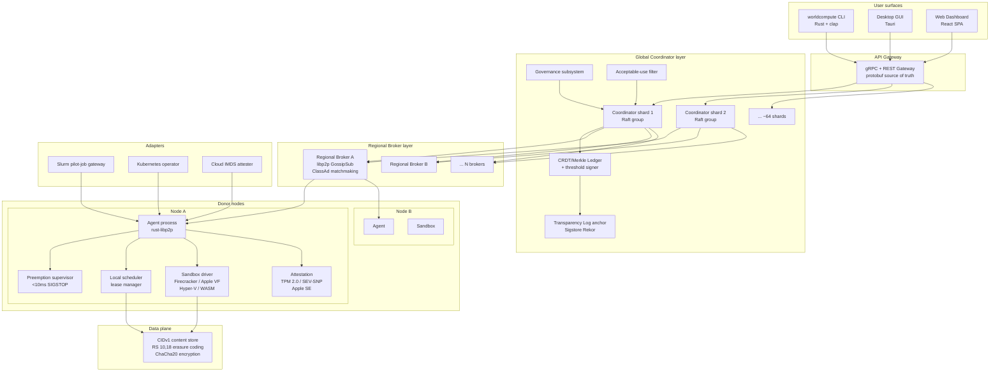

# World Compute — Consolidated Architecture Design

**Document type**: Architecture design (opinionated, authoritative)
**Version**: 0.1.0-draft
**Date**: 2026-04-15
**Status**: Draft — pending TSC review before implementation begins

---

## 1. Purpose and Scope

This document is the single authoritative architectural reference for engineers implementing World Compute Core (spec `001-world-compute-core`). It defines what the system is, how its major components are structured, how they interact, and why each load-bearing decision was made. It is not the public whitepaper (`whitepaper.md`), not a protocol specification, and not an API reference — those are separate documents. Every decision here traces to either the ratified constitution (`.specify/memory/constitution.md`, v1.0.0) or to a specific finding in the research package (`research/01` through `research/07`). Where open questions remain unresolved, they are flagged explicitly in Section 15. Implementers who find a conflict between this document and a lower-level design doc should treat this document as authoritative and raise an amendment via pull request.

---

## 2. Architectural Tenets

These eight rules are load-bearing. Any design that violates one requires an explicit, reviewed exception recorded in the spec.

**T1 — The VM boundary is non-negotiable.**
Every platform that can run a hypervisor must use one (Firecracker/KVM on Linux, Apple Virtualization.framework on macOS, Hyper-V/WSL2 on Windows). Process-level sandboxing alone — namespaces, seccomp, gVisor, bubblewrap — is not an acceptable outer boundary for donor-machine workloads. This is Principle I. The only exception is browser/mobile (Tier 0), where no VM path exists; those donors receive only low-trust public-data workloads. Source: `research/03`.

**T2 — The local agent owns preemption authority exclusively.**
No network round-trip may be on the critical path of freezing a workload. The local agent fires SIGSTOP (or the platform equivalent) within 10 ms of any sovereignty trigger, autonomously, without consulting a broker or coordinator. Preemption is a local-hardware event, not a scheduling decision. This is Principle III. Source: `research/01` finding F4, `research/06`.

**T3 — No blockchain.**
The credit/accounting ledger is a CRDT-replicated, Merkle-chained, threshold-signed append-only log. Merkle roots are anchored to an external transparency log (Sigstore Rekor) every 10 minutes. There is no mining, no staking, no gas, no token traded on external markets. Every problem blockchains solve here has a cheaper, faster, non-chain solution compatible with Principle IV (joules-per-result must improve). Source: `research/02`.

**T4 — Sharded, federated control plane — not a single Raft group.**
The global coordinator is sharded Raft (~64 shards initially), not a monolithic etcd cluster. Each shard owns a slice of the job catalog and ledger. No tier may be on the critical path of another tier's hard guarantees: brokers operate if coordinators are partitioned; local agents operate if brokers are unreachable. Source: `research/01`.

**T5 — Content-addressed everything.**
All job artifacts, inputs, outputs, checkpoints, and workload images are identified by CIDv1 (SHA-256). The scheduler moves CIDs, not bytes. The data plane moves bytes. These are separate concerns with separate components. Source: `research/04`.

**T6 — Direct testing on real hardware gates every release.**
Mocks and simulators are permitted for regression speed but are never the sole evidence of correctness for any production component. Every release must produce a direct-test evidence artifact: job run, hardware, inputs, expected vs. observed outputs, pass/fail. Safety-critical paths (sandboxing, preemption, attestation) require adversarial cases on every release. This is Principle V and is non-negotiable. Source: constitution Principle V, `research/07`.

**T7 — Donors are sovereign; paid users are not privileged.**
The priority ordering LOCAL_USER > DONOR_REDEMPTION > PAID_SPONSORED > PUBLIC_GOOD > SELF_IMPROVEMENT is enforced by the scheduler and may not be overridden by configuration or financial contribution. Paid jobs never preempt donor-redemption jobs. The self-improvement slice (5–10% of cluster capacity) is permanently reserved and never competes in the priority queue. This is Principle III. Source: `research/06`.

**T8 — Failure is the normal operating condition.**
Byzantine donors, continuous churn, network partitions, and mid-job node loss are not edge cases to handle gracefully — they are the assumed steady state. Every component must define its failure modes explicitly and degrade gracefully rather than fail catastrophically. Source: constitution Principle II.

---

## 3. System Overview



---

## 4. Component Decomposition

### 4.1 Agent (per-host background process)

**Purpose**: The agent is the sole process that runs on donor hardware. It owns peer identity, manages sandboxes, enforces donor sovereignty, communicates with brokers and coordinators, and reports contribution to the ledger. It is the trust boundary between the cluster and the donor's machine.

**Inputs**: Job leases from regional broker (via libp2p); attestation challenges from coordinator; sovereignty events from local OS (HID, thermal, power, screen); donor configuration; workload images/inputs via CIDv1 data plane.

**Outputs**: Heartbeat and lease renewals to broker; checkpoint CIDs and result hashes to broker; attestation quotes to coordinator; credit ledger entries (via coordinator); preemption notifications; telemetry (structured logs, metrics, traces).

**Dependencies**: Sandbox driver (4.2); preemption supervisor (4.3); local scheduler/lease manager (4.4); libp2p stack; TPM/SEV attestation subsystem (4.9); data plane client (4.7).

**Key invariants**:
- Agent binary is reproducibly built, code-signed (macOS Notarization, Windows Authenticode, Linux GPG), and measured in TPM PCR at launch. Coordinator will not dispatch jobs to an unattested agent.
- Agent drops to minimum required privileges immediately after initialization.
- On withdrawal, agent removes all World Compute state from the host: no files outside the scoped working directory, no startup hooks, no scheduled tasks, no network routes.
- Agent never stores plaintext submitter data outside the sandbox working directory, which is wiped on job completion.

**Failure modes**: Agent crash — sandbox driver detects absence of heartbeat; broker marks lease expired; job rescheduled from latest checkpoint. Agent compromised — TPM PCR mismatch on next attestation; coordinator quarantines node; P0 incident protocol if escape is confirmed.

**v1 scope**: Linux, macOS, Windows (all rust-libp2p per FR-006). js-libp2p for browser donors in Phase 3. Mobile deferred to Phase 3.

---

### 4.2 Sandbox Driver

**Purpose**: Provides the hypervisor-level isolation boundary between workload and host. Abstracts over platform-specific VM runtimes behind a unified interface: `launch(image_cid, resource_envelope) → sandbox_handle`, `snapshot(handle) → checkpoint_cid`, `restore(checkpoint_cid, resource_envelope) → handle`, `freeze(handle)`, `thaw(handle)`, `terminate(handle)`.

**Platform implementations**:
| Platform | Primary | Fallback |
|-|-|-|
| Linux x86-64/ARM64 | Firecracker + KVM | Kata + QEMU (no KVM) |
| macOS Intel + Apple Silicon | Apple Virtualization.framework | None |
| Windows 10/11 Pro | Hyper-V + WSL2 utility VM | QEMU + WHPX (Windows Home) |
| Browser / Mobile | Wasmtime / browser WASM | None |

**Key invariants**:
- Guest has no access to host filesystem, credentials, network, LAN peers, camera, mic, clipboard, GPS, or USB devices. Verified adversarially on every release (red-team tests T1–T8 from `research/03`).
- GPU passthrough (Linux only) requires verified singleton IOMMU group; the ACS-override patch is prohibited; VFIO interrupt remapping is mandatory.
- Sandbox working directory is size-capped and wiped on job completion or agent exit.
- macOS GPU passthrough is not supported (Apple Silicon Metal is host-only as of 2026). macOS donors are CPU-only.

**Failure modes**: VMM CVE — P0 incident; coordinator remotely disables affected agent versions within one release cycle; no new dispatches until patched and direct-tested. IOMMU misconfiguration — agent rejects GPU passthrough at registration time; falls back to CPU-only.

**v1 scope**: All four platform paths. WASM workloads inside Firecracker VMs (defense-in-depth inner layer) are Phase 2.

---

### 4.3 Preemption Supervisor

**Purpose**: Monitors local sovereignty signals and fires the mandatory freeze within 10 ms. This is the component that makes Principle III real. It runs as a privileged sub-process of the agent with direct access to OS event APIs, independent of any network path.

**Sovereignty triggers and latency targets**:
| Trigger | Target | Mechanism |
|-|-|-|
| Keyboard / mouse | 10 ms to SIGSTOP | libinput (Linux), XInput (macOS), WinHook (Win) |
| Foreground app change | 10 ms | NSWorkspace / GetForegroundWindow / _NET_ACTIVE_WINDOW |
| AC power lost | 500 ms | upower / IOKit / WMI power event |
| CPU/GPU thermal > 80°C | 500 ms | sysfs / IOKit / WMI, 1 Hz poll with hysteresis |
| RAM > 80% | 200 ms | /proc/meminfo or vm_stat, 2 Hz poll |
| User-defined rules | 1000 ms | YAML policy file, evaluated by agent loop |

**Protocol**: Phase 1 (≤10 ms) — SIGSTOP or SuspendThread to all sandbox processes; CPU/GPU yield immediate. Phase 2 (0–500 ms) — SIGTERM + checkpoint request; workload flushes state to local scratch. Phase 3 (500 ms hard deadline) — SIGKILL/TerminateProcess; partial checkpoints discarded; scheduler notified for reschedule from last committed checkpoint. Phase 4 — after N idle seconds (default 30, configurable), sandboxes thaw; resources restored gradually (nice/ionice first, then full allocation after 5 s stability).

**Key invariant**: Preemption authority is local-only. No network call is on the path from sovereignty event to SIGSTOP. Violating this invariant makes the 10 ms budget physically impossible.

**Failure modes**: Supervisor crash — agent watchdog restarts it; no sandbox may run without an active supervisor. GPU kernel in flight at SIGSTOP — kernels ≤200 ms window guaranteed (v1 GPU donors must pass preemption-latency test during registration); longer kernels are a Tier 2 investigation item (CUDA MPS, GPU time-slicing).

---

### 4.4 Local Scheduler / Lease Manager

**Purpose**: Manages the lifecycle of task leases on this host. Pulls work from the regional broker when the agent is idle, tracks lease heartbeat deadlines, coordinates with the sandbox driver for launch/checkpoint/terminate, and reports outcomes to the broker.

**Key invariants**:
- Lease is short (default 5 min) and must be heartbeat-renewed every 30 s. Lease loss triggers broker rescheduling without submitter action.
- Task placement respects donor opt-in classes; tasks whose `acceptable_use_classes` include a class the donor has opted out of are rejected at lease-accept time, not after execution.
- When a replica is preempted, the local scheduler immediately notifies the broker; a hot standby (from the broker's pre-warmed pool at ≥120% of active replica count) is promoted automatically.

**Failure modes**: Heartbeat loss — broker declares lease expired after two missed intervals (10–30 s); job rescheduled from latest checkpoint CID. Double-dispatch — coordinator's linearizable job-state Raft group prevents two agents from accepting the same task replica.

---

### 4.5 Regional Broker

**Purpose**: Owns the task queue for a geographic/network region. Matches tasks to agents using ClassAd-style bilateral matchmaking (task requirements vs. node capability advertisements), manages leases, tracks speculative re-execution for stragglers, and propagates workflow state to the global coordinator at workflow-completion granularity.

**Inputs**: Task assignments from global coordinator; capability advertisements (ClassAds) from agents via GossipSub; lease heartbeats; preemption notifications; result hashes from agents.

**Outputs**: Lease grants to agents; work-fetch responses; speculative replica launches; partial workflow state to coordinator.

**Key invariants**:
- A broker is itself a donor node elevated by reputation; any well-behaved Tier 1 node with adequate uptime may serve as a broker for hundreds of local agents.
- Brokers operate if the global coordinator is partitioned (graceful degradation: serve from cached task queue; do not accept new workflow submissions until reconnected).
- LAN micro-clusters elect one agent as a transient broker via mDNS election (lowest Peer ID wins after 2 s of stable discovery). This broker registers as a regional shard with `shard_size=N, gateway=true`.
- Replica placement enforces disjoint buckets: replicas must span different autonomous systems, geographic regions, and Trust Score buckets. Same-/24 and same-AS placement of two replicas for the same task is rejected.

**Failure modes**: Broker crash — agents fail over to next-nearest broker (DHT routing table lookup); queued leases re-assigned within one heartbeat interval. Broker flood — rate limiting per submitter at broker ingress; tasks exceeding burst quota are queued, not dropped.

---

### 4.6 Global Coordinator

**Purpose**: The system of record for the full workflow catalog, credit ledger, acceptable-use policy, node registry, and governance records. Not on the critical path of individual task execution. Provides linearizable job-state transitions (preventing double-dispatch) and the authoritative trust-score and caliber-class registry.

**Implementation**: Sharded Raft, ~64 shards initially. Each shard is a 5-node Raft group distributed across geographically separate coordinator nodes. Coordinator nodes are a small, hardened set (~100–1000) operated by the project and vetted partners — not ordinary volunteer hardware.

**Key invariants**:
- Coordinators are Tier 1 hardened nodes only; they are separately audited infrastructure, not the volunteer pool.
- No company may operate more than 20% of coordinator nodes.
- The ledger shard is the sole writer of threshold-signed credit events. Threshold is 2/3 of coordinator quorum (BLS threshold signatures).
- Every 10 minutes, a Merkle root of the ledger is published to Sigstore Rekor (or equivalent external transparency log). A single compromised coordinator cannot rewrite history undetected.
- Coordinator failure survivability: the system survives loss of any individual region or 1/3 of coordinator nodes.

**Failure modes**: Coordinator compromise — threshold signing means no single coordinator can forge a credit event; Merkle root publication to external log bounds undetected tampering to the 10-minute window. Coordinator set partitioned — shards on the minority side become read-only; brokers continue serving from cached state; new workflow submissions queue until quorum restores.

---

### 4.7 Data Plane (CIDv1 Store, Erasure Coding)

**Purpose**: Durable, content-addressed, encrypted storage for all job artifacts: workload images, inputs, outputs, checkpoints. Completely separate from the control plane; the coordinator supplies CID→shard-location metadata; actual byte transfer is direct executor↔donor-storage.

**Cold tier**: RS(10,18) erasure coding. 1.8× storage overhead. Any 10 of 18 shards reconstruct the original. Placement enforced: 1 shard per autonomous system, ≤2 shards per country, ≥3 continents. P(data loss) = 2.09×10⁻⁵ at 10% per-shard churn with placement constraints. Chunk size: 4 MB per shard (40 MB logical chunks). Source: `research/04`.

**Hot tier**: 3× synchronous replication on executor nodes during job execution. Staged in at job start, wiped at completion. No RS reconstruction latency on the critical path of computation.

**Encryption**: ChaCha20-Poly1305 per chunk; random 32-byte key per chunk; keys wrapped with submitter's X25519 public key and stored in job manifest — not on storage donors. Storage donors receive only ciphertext shards. With fewer than k=10 ciphertext shards, reconstruction is impossible by design.

**Key invariants**:
- Every chunk is identified by its CIDv1 (SHA-256). Integrity verification is O(1) on receipt; deduplication is automatic; caching is correct by construction.
- Coordinator is blind to data content — it routes CIDs and shard locations only, never plaintext or unwrapped keys.
- Donor storage cap enforced by signed quota tokens; coordinator refuses shard assignments exceeding declared quota.
- On donor withdrawal: coordinator immediately begins re-encoding affected shards to replacement donors. Withdrawing donor stays online for a 30-minute handoff window; after that, quota is released regardless.

**Failure modes**: 8 simultaneous random shard losses — reconstructible from remaining 10. Country-scale outage — capped at 2 shards/country; remains within 8-loss budget. Malicious shard — AEAD tag rejection; automatic failover to alternate shard holder. Coordinator metadata stale — stale shard locations cause fetch failures, not data corruption; executor retries next available holder.

**v1 scope**: Batch staging only. Streaming input for datasets too large to pre-stage is Phase 3.

---

### 4.8 CRDT/Merkle-Chained Ledger + Transparency Log

**Purpose**: The tamper-evident, append-only record of all credit events, job outcomes, and governance actions. Provides the audit trail that makes Principle III's transparency guarantee real.

**Structure**: OR-Map CRDT with monotonically increasing vector clocks per entry. Each entry is hash-chained to its predecessor (Merkle chain). Entries are threshold-signed (BLS 2/3-of-coordinator-quorum) before being considered committed. Every 10 minutes the current Merkle root is submitted to Sigstore Rekor (or a functionally equivalent external transparency log) for public timestamping. The Rekor inclusion proof is stored alongside the root.

**Key invariants**:
- A committed credit event is immutable. No single coordinator can alter history; doing so would break the hash chain and diverge from the publicly anchored Merkle root.
- Every donor can verify their own credit history locally: `worldcompute donor credits --verify` downloads their ledger slice and validates the hash chain and inclusion proof against the public transparency log.
- Governance proposals and votes are written to the same ledger, making governance history equally tamper-evident.

**Why not a blockchain**: On-chain settlement of every task event is latency-prohibitive (seconds to minutes per event), cost-prohibitive (gas fees), and ecologically wasteful — a direct Principle IV violation. The CRDT+Raft+Rekor combination gives equivalent tamper-evidence at sub-second write latency with zero mining cost. Source: `research/02`.

---

### 4.9 Trust/Attestation Subsystem

**Purpose**: Cryptographically establishes what software is running on a donor node and maintains the per-node Trust Score that gates workload eligibility.

**Trust tiers** (see Section 8 for full table):
- T0: browser/WASM, no hardware attestation. R≥5, public-data only.
- T1: TPM 2.0 PCR quote, Trust Score 0.4–0.7, age ≥7 days. R=3.
- T2: TPM + SecureBoot, Trust Score 0.7–0.95, age ≥30 days. R=3 or R=2+audit.
- T3: SEV-SNP or TDX attestation, Trust Score ≥0.95. R=1 (TEE-attested) or R=2.
- T4: NVIDIA H100 Confidential Compute. R=1 (TEE-attested GPU). Confidential workloads eligible.

**Trust Score formula**: `T = clamp(0,1, 0.5·R_consistency + 0.3·R_attestation + 0.2·R_age) · (1 − P_recent_failures)`. Starts at 0.5 for new nodes; cannot exceed 0.5 for the first 7 days; ramps to 1.0 after 30 days of consistent quorum agreement. Source: `research/02`.

**Attestation flow**: Coordinator issues a nonce challenge → agent's TPM signs a PCR quote binding the agent binary hash, VMM binary hash, and OS boot state → coordinator verifies EK certificate chain (manufacturer root) + AK binding + expected PCR values for the current signed agent version → node is admitted.

**Failure modes**: PCR mismatch — node quarantined; coordinator logs anomaly; human review triggered. Attestation key compromise — node keypair revoked; operator re-enrollment required.

---

### 4.10 Credit and Accounting Subsystem

**Purpose**: Implements the Normalized Compute Unit (NCU) economy that makes Principle III's "same caliber" guarantee enforceable and auditable.

**NCU definition**: 1 NCU = 1 TFLOP/s FP32 sustained for 1 second on an NVIDIA A10G reference platform. Multi-dimensional: compute NCU-s, memory GB·s, storage GB·s, network GB transferred. Credit earned = dominant dimension (DRF-style), preventing over-claiming.

**Credit decay**: 45-day half-life. Minimum balance floor = trailing 30-day contribution rate (protects donors on break). Inflation control: if outstanding credits exceed 110% of trailing 30-day redemption demand, decay rate increases 10% until ratio drops below 100%.

**Redemption guarantee**: A donor with earned credits tagged at caliber class C is entitled to cluster compute at class ≥C within p95 < 2 hours queue time. If no class-C node is available within 4 hours, scheduler escalates to EMERGENCY_DONOR, which preempts PAID_SPONSORED jobs.

**Failure modes**: Credit hoarding — 45-day decay bounds maximum hoarded supply. Benchmark gaming — server-side cross-validation against hardware profile database; nodes reporting >15% above expected range are flagged; Trust Score penalized. Double-spend — linearizable ledger shard prevents concurrent redemption of the same credit balance.

---

### 4.11 Acceptable-Use Filter

**Purpose**: Enforces that only compliant workloads reach the cluster. Runs as an admission-control gate at workflow submission time in the coordinator layer.

**Prohibited categories** (hard-coded, not configurable by governance): unauthorized network scanning, malware distribution, illegal content, targeted surveillance, credential cracking against third parties.

**Donor opt-in enforcement**: Each donor's ClassAd includes their opted-in job classes (e.g., `scientific`, `ml-training`, `rendering`). The broker rejects any lease grant for a task whose `acceptable_use_classes` set is not a subset of the agent's opted-in classes.

**Failure modes**: False negative (harmful job accepted) — governance may trigger emergency halt; affected agent versions may be remotely disabled. False positive (legitimate job rejected) — submitter appeal process via governance API.

---

### 4.12 Governance Subsystem

**Purpose**: Implements the TSC/Board decision-making model. Records proposals, votes, and outcomes on the ledger. Enforces the constitutional amendment process.

**Structure**: Two-body model. TSC (5–7 individuals, merit-elected, no company holds >2 seats) owns technical decisions. Board of Directors (5 members) owns financial/legal decisions. Constitutional amendments require 2/3 supermajority of both bodies. Source: `research/07`.

**Emergency powers**: Designated on-call responders may halt cluster operations without prior governance approval for active Principle I (safety) or Principle II (data-loss) incidents. Retroactive review within 7 days is mandatory.

**Key invariant**: Financial donation never confers scheduling priority. This is stated in every major-donor agreement and in the bylaws. The scheduler is the sole authority on job placement; it does not receive financial signals.

---

### 4.13 CLI (`worldcompute`)

**Purpose**: Single statically-linked binary serving donors, submitters, and administrators. Reproducibly built, code-signed.

**Implementation**: Rust + `clap`. Go + `cobra` is an acceptable alternative if the core team has stronger Go expertise. Python is ruled out (runtime dependency on donor machines is attack surface). Source: `research/07`.

**Subcommand groups**: `donor` (join, status, pause, resume, withdraw, credits, logs), `job` (submit, status, cancel, results, list, retry), `cluster` (status, peers), `admin` (propose, vote, report, halt, resume, ban), `config` (set, get, validate).

---

### 4.14 Desktop GUI (Tauri)

**Purpose**: Native desktop app for donor onboarding, status monitoring, and job submission. Not required for headless server donors.

**Implementation**: Tauri (OS-native WebView — WebKit/macOS, WebView2/Windows, WebKitGTK/Linux). Electron is rejected: bundling a full Chromium runtime adds ~150 MB attack surface to donor machines — a direct Principle I violation. Tauri backend is Rust, consistent with CLI. Frontend is React (shared with web dashboard). Source: `research/07`.

---

### 4.15 Web Dashboard (React SPA)

**Purpose**: Donor and submitter workflows at feature parity with the CLI. Served as a static SPA from a CDN. No server-side rendering required.

**Constraints**: WCAG 2.1 AA compliance is a launch gate. i18n (react-i18next) built in from day one; English + ≥2 launch languages.

---

### 4.16 Adapters

**Slurm pilot-job gateway**: A long-lived `sbatch` allocation running the World Compute agent. Translates incoming task specs into `srun` commands within the allocation. Presents the entire HPC allocation as a single aggregate node. Source: `research/05`.

**Kubernetes operator**: `WorldComputeNode` CRD; operator watches for task assignments and creates Pods honoring namespace resource limits. Source: `research/05`.

**Cloud IMDS attester**: Instance Metadata Service attestation (AWS IMDSv2 + Nitro, GCP VM identity token, Azure IMDS). Attestation document included in capability advertisement. Source: `research/05`.

---

## 5. Data Flow: Job Lifecycle

```mermaid
sequenceDiagram
    participant S as Submitter
    participant GW as API Gateway
    participant AUF as AUF / Coordinator
    participant DP as Data Plane
    participant RB as Regional Broker
    participant A1 as Agent (replica 1)
    participant A2 as Agent (replica 2)
    participant A3 as Agent (replica 3)
    participant L as Ledger + Tlog

    S->>GW: POST /v1/jobs (job.yaml)
    GW->>AUF: validate acceptable-use, signature, resources
    AUF-->>GW: job_id + CID
    GW->>DP: stage inputs (encrypt, RS shard, place)
    DP-->>GW: input CIDs confirmed
    GW->>AUF: enqueue task to coordinator catalog
    AUF->>RB: assign task (CID, R=3, disjoint placement)
    RB->>A1: lease grant (task CID, resource envelope)
    RB->>A2: lease grant
    RB->>A3: lease grant
    A1->>DP: fetch input shards (reconstruct)
    A2->>DP: fetch input shards
    A3->>DP: fetch input shards
    Note over A1,A3: Execute in sandbox; checkpoint every 60s
    A1->>DP: write checkpoint CID (60s interval)
    A2->>DP: write checkpoint CID
    A3->>DP: write checkpoint CID
    A1->>RB: result hash + attestation quote
    A2->>RB: result hash + attestation quote
    A3->>RB: result hash + attestation quote
    RB->>AUF: 2-of-3 quorum reached; canonical result CID
    AUF->>DP: finalize output (RS shard, place, set TTL)
    AUF->>L: threshold-sign credit event (A1+A2+A3 earn NCUs; submitter debited)
    L->>L: hash-chain entry; anchor Merkle root to Rekor (every 10 min)
    AUF-->>S: job complete; result CID + verification artifact
    S->>DP: fetch result (reconstruct from shards)
```

**3% spot-check audit**: Async post-quorum, coordinator randomly selects ~3% of accepted results for re-execution on an independent high-trust node. Mismatch triggers Trust Score collapse and quarantine for the colluding replica(s).

---

## 6. Data Flow: Donor Lifecycle

```mermaid
sequenceDiagram
    participant D as Donor
    participant CLI as worldcompute CLI
    participant AGT as Agent
    participant ATT as Attestation subsystem
    participant COORD as Coordinator
    participant RB as Regional Broker
    participant SDB as Sandbox
    participant PSUP as Preemption supervisor
    participant L as Ledger

    D->>CLI: worldcompute donor join
    CLI->>AGT: generate Ed25519 keypair; persist to keystore
    AGT->>AGT: run microbenchmarks (FP32 GEMM, memory BW, disk IOPS)
    AGT->>ATT: request TPM PCR quote (nonce from coordinator)
    ATT-->>AGT: signed quote
    AGT->>COORD: enroll (public key, benchmark, quote, opt-in classes)
    COORD->>COORD: verify attestation chain; assign Trust Tier; assign Trust Score = 0.5
    COORD-->>AGT: node_id; coordinator epoch; trust cert
    AGT->>RB: publish ClassAd (capability, opt-in classes, caliber class)
    RB-->>AGT: registered; waiting for tasks
    Note over AGT,RB: Machine idle: agent polling for leases
    RB->>AGT: lease grant (task CID, resource envelope)
    AGT->>SDB: launch sandbox (fetch image CID, resource envelope)
    SDB-->>AGT: sandbox_handle
    Note over SDB: Task executing; checkpoints every 60s
    D->>PSUP: user moves mouse (sovereignty event)
    PSUP->>SDB: SIGSTOP (t<10ms)
    SDB->>SDB: suspend execution
    PSUP->>RB: preemption notification; lease released
    Note over D: User works; agent idle
    D->>PSUP: user idle 30s
    PSUP->>SDB: thaw; restore allocations
    SDB-->>AGT: task resumes from latest checkpoint
    Note over AGT: Task completes
    AGT->>RB: result hash; attestation
    RB->>COORD: quorum reached; credit event
    COORD->>L: threshold-sign NCU credit for donor
    D->>CLI: worldcompute donor credits
    CLI->>L: fetch + verify credit history (hash chain + Rekor inclusion proof)
    D->>CLI: worldcompute job submit (redeem credits)
    Note over D,COORD: Donor redemption: p95 queue < 2h at same caliber class
    D->>CLI: worldcompute donor withdraw
    CLI->>AGT: initiate withdrawal
    AGT->>COORD: signal withdrawal; start 30-min shard handoff
    AGT->>AGT: wipe working directory; revoke keypair
    Note over AGT: No residual state on host after agent exit
```

---

## 7. State Machines

### Task State Machine

```mermaid
stateDiagram-v2
    [*] --> Queued : Submitted + validated
    Queued --> Staging : Broker assigns lease; inputs fetching
    Staging --> Dispatched : Inputs staged; sandbox launching
    Dispatched --> Running : Sandbox executing
    Running --> Checkpointing : 60s interval or preemption
    Checkpointing --> Running : Checkpoint committed; continue
    Checkpointing --> Preempted : Sovereignty event; lease released
    Running --> Completed : Task finished; result hash produced
    Running --> Failed : Sandbox crash / timeout
    Preempted --> Queued : Rescheduled from checkpoint CID
    Failed --> Queued : Retry from latest checkpoint (if exists)
    Failed --> [*] : Max retries exceeded; workflow-level error
    Completed --> Verifying : Broker collecting R replica hashes
    Verifying --> Verified : 2-of-3 (or policy) quorum agrees
    Verifying --> Disputed : Quorum fails; hashes diverge
    Disputed --> Queued : Re-execute on fresh replicas
    Disputed --> [*] : Persistent mismatch; audit escalation
    Verified --> Committed : Ledger entry threshold-signed
    Committed --> [*]
```

### Node State Machine

```mermaid
stateDiagram-v2
    [*] --> Unknown : Fresh install; no peer contact
    Unknown --> Enrolling : worldcompute donor join initiated
    Enrolling --> Attesting : Keypair generated; TPM challenge received
    Attesting --> Healthy : Attestation verified; Trust Tier assigned
    Healthy --> Yielding : Sovereignty event fires
    Yielding --> Healthy : Sovereignty event clears; idle restored
    Healthy --> Cooling : Sustained thermal / battery pressure
    Cooling --> Healthy : Pressure clears
    Healthy --> Unhealthy : Missed heartbeats; quorum failures
    Unhealthy --> Quarantined : Attestation failure OR result fraud detected
    Unhealthy --> Healthy : Self-heal; heartbeats resume
    Quarantined --> [*] : Human review; permanent ban or re-enrollment
    Healthy --> Withdrawn : worldcompute donor withdraw
    Withdrawn --> [*] : State wiped; keypair revoked
```

---

## 8. Trust Tier and Caliber Class Tables

### Trust Tiers

| Tier | Definition | Hardware qualifies | Quorum default | Workloads eligible |
|-|-|-|-|-|
| T0 | No hardware attestation; browser/WASM sandbox | Browser tab, mobile PWA, WASM runtime without TPM | R≥5 | Public-data, loss-tolerant, embarrassingly parallel |
| T1 | TPM 2.0 PCR quote; Trust Score 0.4–0.7; age ≥7 days | Any x86 laptop/desktop with TPM 2.0 (post-2016); macOS with Secure Enclave chain | R=3 + 3% audit | Scientific, public-good, self-improvement |
| T2 | TPM + SecureBoot verified; Trust Score 0.7–0.95; age ≥30 days | Well-established T1 nodes with SecureBoot enforced; VM-capable with verified IOMMU | R=3 or R=2 + 2% audit | All except confidential workloads |
| T3 | AMD SEV-SNP, Intel TDX, or TPM+SecureBoot with Trust Score ≥0.95 | EPYC Milan/Genoa, Sapphire Rapids+ (datacenter/cloud); high-tenure well-behaved nodes | R=1 (TEE-attested) or R=2 + 1% audit | All including confidential-medium |
| T4 | NVIDIA H100/H200 Confidential Compute; full attestation chain | H100/H200 datacenter GPUs with SPDM attestation | R=1 (TEE-attested GPU) + 1% audit | All including confidential GPU training |

### Caliber Classes

| Class | Label | Example hardware | Approx NCU/hr | Workloads |
|-|-|-|-|-|
| 0 | Embedded | Raspberry Pi 4/5, phones, edge IoT | 0.01 | Tiny parameter sweeps, sensor processing |
| 1 | Consumer CPU | Laptop i7/i9, desktop Ryzen 7, Mac M-series (CPU-only) | 0.10 | General batch, small ML inference, scientific |
| 2 | Consumer GPU | NVIDIA RTX 3080/4070, AMD RX 7900 | ~30 | ML training (data-parallel), rendering, simulation |
| 3 | Prosumer GPU | RTX 4090, NVIDIA A5000, AMD W7900 | ~82 | Large ML training, high-res rendering |
| 4 | Data Center | A100, H100, H200 | ~312 | LLM training, large-scale scientific, confidential GPU |

The "same caliber" redemption guarantee: a donor who contributed at class C is entitled to redemption compute at class ≥C within the SLA window. Voluntary downgrade earns a 30% NCU refund multiplier per class tier sacrificed.

---

## 9. Concurrency, Consistency, and Failure Model

**Consistency layers**:
- *Data reads*: always consistent — CIDv1 is a cryptographic commitment; if a fetch verifies, the bytes are exactly what was written. No stale read for immutable content-addressed data.
- *Shard location metadata*: causally consistent — CRDT OR-Map with vector clocks. Stale locations cause fetch failures, not corruption; executor retries next available holder.
- *Job state transitions*: linearizable — Raft-per-shard coordinator; prevents duplicate dispatch.
- *Credit events*: linearizable within coordinator epoch — threshold-signed; hash-chained; externally anchored.

**Failure scenarios and system response**:

| Failure | Detection | Response | Guarantee |
|-|-|-|-|
| Single node loss (mid-job) | Missed heartbeat within 5–15 s | Reschedule from latest checkpoint onto alternate node in same trust/placement bucket | No job loss if checkpoint committed within 60 s window |
| Region loss | Coordinator shard minority-side becomes read-only | Brokers serve from cached task queue; new submissions queue | No data loss; 30-min degraded service |
| Coordinator compromise | Threshold signature requires 2/3 quorum; single compromised node cannot forge | Merkle root diverges from Rekor anchor within 10-min window; operator alert | Credit history integrity: tamper detectable within 10 min |
| Byzantine donor flood (1,000 Sybil VMs) | libp2p /16 IP-diversity caps; 7-day Trust Score floor; disjoint-AS replica placement; 3% audit | Sybil nodes capped in routing table; quorum collusion probability bounded by disjoint placement; ~95% detection within 100 audited tasks | Source: `research/02` §1.7 |
| Network partition | Coordinator shard loses quorum | Minority-side read-only; LAN micro-cluster continues autonomously; CRDT reconciles on re-merge; no committed credits lost | Source: `research/01` §4.3 |
| CVE in VMM (P0 incident) | Disclosure or internal detection | Coordinator remotely disables affected agent versions within one release cycle; no new dispatches to affected sandboxes cluster-wide until fix direct-tested | Constitution Principle I; `research/03` §5 |
| GPU kernel preemption stall | Preemption supervisor monitors GPU utilization post-SIGSTOP | v1: GPU donors capped to ≤200 ms kernel windows; registration-time preemption-latency test required | Open question: CUDA MPS for longer kernels |

---

## 10. Security Architecture

### Threat Model

| Actor | What they can attack | Mitigations |
|-|-|-|
| Malicious donor | Return wrong results; escape sandbox; exfiltrate submitter data | R=3 quorum; disjoint placement; 3% audit; VM-boundary sandbox; client-side encryption of submitter data |
| Byzantine donor flood (Sybil) | Dominate quorum; corrupt results at scale | IP-diversity caps in DHT; Trust Score floor (7-day ramp); disjoint-AS replica placement |
| Compromised coordinator | Rewrite credit history; forge ledger entries | Threshold signing (2/3 quorum to forge); Merkle root anchored to external Rekor every 10 min |
| Supply chain attacker | Ship malicious agent binary to donors | Reproducible builds; code signing (macOS/Win/Linux); TPM PCR measurement; coordinator refuses unattested agent |
| Submitter data theft | Read job inputs/outputs from storage donors | ChaCha20-Poly1305 client-side encryption; X25519 key wrapping; coordinator never receives plaintext |
| Governance capture | Concentrate TSC/Board control | No company holds >2 of 7 TSC seats; 2/3 supermajority for amendments; public ledger for all votes |

### Trust Boundaries

1. Donor host OS ↔ sandbox: VM hypervisor boundary (non-negotiable; see T1).
2. Sandbox ↔ data plane: CIDv1 integrity; AEAD per-chunk; no plaintext on wire.
3. Agent ↔ broker: libp2p Noise XX (mutual auth, forward secrecy, no CA dependency).
4. Broker ↔ coordinator: mTLS + Ed25519 peer identity.
5. Coordinator ↔ transparency log: signed Merkle root submission to Rekor; inclusion proof stored.
6. CLI/GUI ↔ API gateway: OAuth2/JWT for user-facing; mTLS for agent-to-agent.

### Key Management

- **Per-agent Ed25519 keypair**: generated at first `donor join`; private key stays on donor hardware (OS keychain or encrypted keystore); never leaves the machine. Peer ID = multihash of public key.
- **Coordinator threshold signing keys**: BLS keys distributed across coordinator quorum using Shamir Secret Sharing; no single coordinator holds a complete signing key. Key rotation on coordinator epoch change via Raft-consensus ceremony.
- **Sigstore/Rekor anchoring**: project operates a Rekor-compatible transparency log endpoint; Merkle root submissions are also mirrored to the public Rekor instance for independence.
- **Supply chain**: all release binaries are reproducibly built (deterministic from source); build provenance recorded via SLSA Level 3; binary hashes published on the project's transparency page; GPG-signed release packages on Linux.

---

## 11. Observability

Every production component MUST emit the following. "We don't know what happened" is not an acceptable post-mortem conclusion (constitution Development Workflow).

**Structured logs** (JSON, to stdout; aggregated by coordinator-operated log sink):
- Agent: sandbox lifecycle events (launch, freeze, thaw, terminate), lease events, sovereignty trigger events with latency measurements, attestation outcomes, checkpoint CIDs.
- Broker: lease grant/release/expiry, quorum outcomes, replica placement decisions, straggler detections.
- Coordinator: workflow state transitions, credit events (without plaintext data), governance actions, Rekor anchor confirmations.
- Data plane: shard write/read/reconstruct events, quota enforcement decisions, GC events.

**Metrics** (Prometheus exposition format; scraped by coordinator-operated Prometheus):
- Per-agent: tasks running, CPU/GPU utilization, preemption latency histogram (p50/p95/p99), checkpoint write latency, lease heartbeat success rate.
- Per-broker: task queue depth, lease grant rate, quorum success rate, straggler re-execution rate.
- Per-coordinator: shard leader election rate, ledger entry throughput, Rekor anchor lag.
- Cluster-wide: job completion rate, NCU-earned/consumed ratio, Trust Score distribution, caliber class distribution, energy consumption (joules-per-NCU, Principle IV).

**Traces** (OpenTelemetry, exported to OTLP endpoint):
- Job lifecycle trace: one root span per job, child spans per task, per replica, per checkpoint, per quorum resolution.
- Critical path tracing: time-to-first-SIGSTOP (sovereignty latency), time-from-quorum-to-ledger-commit.

**Alerts** (PagerDuty / equivalent):
- p99 preemption latency > 500 ms (Principle III SLA at risk).
- Quorum failure rate > 5% over 5 min (Byzantine activity or network fault).
- Rekor anchor lag > 15 min (transparency guarantee at risk).
- Any TPM attestation failure on a node with Trust Score > 0.8 (potential compromise).

---

## 12. API Surface (High-Level)

All services are gRPC-primary. REST/HTTP+JSON gateway is generated from the same protobuf schema via gRPC-gateway. Wire-format details (proto source, field numbers, versioning policy) belong in a separate API reference document.

### DonorService
Methods: `Enroll`, `GetStatus`, `UpdateConfig`, `Pause`, `Resume`, `Withdraw`, `GetCredits`, `GetLogs`, `VerifyCredits`.

### SubmitterService
Methods: `SubmitJob`, `GetJob`, `CancelJob`, `GetJobResults`, `ListJobs`, `RetryJob`, `StreamJobLogs`.

### ClusterService (broker-facing; used by agents)
Methods: `FetchLease`, `HeartbeatLease`, `ReleaseLease`, `ReportResult`, `ReportCheckpoint`, `PublishCapacity`, `GetPeers`.

### GovernanceService
Methods: `SubmitProposal`, `ListProposals`, `CastVote`, `GetProposal`, `PublishReport`, `ListReports`, `ListIncidents`, `ReportIncident`.

### AdminService (on-call responders and coordinators only)
Methods: `HaltCluster`, `ResumeCluster`, `ListNodes`, `BanNode`, `GetAuditLog`, `TriggerSpotAudit`, `RotateCoordinatorKeys`.

---

## 13. Deployment Topology

```
PROJECT-OPERATED INFRASTRUCTURE          DONOR / PARTNER HARDWARE
─────────────────────────────────────    ──────────────────────────────
  Global Coordinator nodes               Personal laptops, desktops
  (~100-1000 hardened nodes)               Linux: Firecracker/KVM
  - Sharded Raft ledger                    macOS: Apple VF
  - Threshold signing                      Windows: Hyper-V/WSL2
  - Transparency log endpoint            
  - DNS bootstrap seeds                  HPC cluster adapters
  - API Gateway (gRPC + REST)              Slurm pilot-job gateways
  - Monitoring stack                       K8s operators
  - CDN (web dashboard static)           
                                         Cloud tenants
  Relay nodes                              AWS/GCP/Azure instances
  (well-connected donor-volunteers           with IMDS attestation
   who opt in; earn relay credits)
                                         Regional Broker nodes
                                           (elevated Tier-1 donors;
                                            anyone with good uptime
                                            and ≥Tier 1 trust)
```

**Minimum viable founding deployment (Phase 1 gate)**:
- 3 coordinator nodes across 3 distinct geographic locations (can be cloud VMs at this phase; hardened later).
- 1 DNS bootstrap seed (anycast preferred; 2 records minimum for redundancy).
- 1 relay node (public IP, project-operated).
- 3–5 donor nodes on a test LAN (physical hardware, not cloud, per Principle V).
- 1 Rekor endpoint (can mirror to public rekor.sigstore.dev initially).

**GA deployment target**:
- ≥100 coordinator nodes across ≥10 countries, ≥3 continents, operated by ≥5 independent organizations.
- ≥50 relay nodes, majority donor-contributed.
- ≥500 active donor nodes across ≥18 autonomous systems (minimum for RS(10,18) cold storage with placement constraints).

---

## 14. Cross-Cutting Decisions

| Decision | Alternative considered | Why we chose this | What would make us reconsider |
|-|-|-|-|
| VM-level sandbox (non-negotiable) | Process sandboxing (seccomp, namespaces) | Kernel CVEs cross process boundaries; cloud providers all use VM isolation for multi-tenant untrusted code (`research/03`) | If a formally verified process sandbox with a proof of kernel-call elimination exists and is audited for our threat model |
| Sharded Raft (not blockchain) | Nakamoto PoW/PoS chain | Latency, cost, joules-per-result; Principle IV violation; every blockchain primitive needed is available without the chain (`research/02`) | If PoW/PoS overhead becomes comparable to Raft coordination overhead at our scale (not plausible near-term) |
| CIDv1 + custom data plane (not IPFS Bitswap) | IPFS native | IPFS lacks RS placement enforcement, configurable GC SLAs, and integrated key management (`research/04`) | If IPFS adds these features with our placement and encryption requirements |
| RS(10,18) erasure code | RS(4,8) or 3× replication | P(loss) at 10% churn: RS(10,18) with placement = 2×10⁻⁵ vs RS(4,8) at 20% churn = 1×10⁻² — 500× difference (`research/04`) | If MSR codes become production-ready and the repair bandwidth savings outweigh implementation risk |
| libp2p (not custom P2P) | Custom DHT, ZeroMQ, NATS | 750k+ nodes in production across Ethereum + IPFS + Filecoin; mDNS + DCUtR + GossipSub already solve our exact problems (`research/05`) | If libp2p adds a dependency or security vulnerability that cannot be isolated |
| Tauri (not Electron) | Electron | Electron ships a full Chromium runtime on donor machines; V8 CVE history is rich; Principle I requires minimal attack surface on donor hardware (`research/07`) | If Tauri's native WebView divergence across platforms creates unacceptable maintenance burden |
| R=3 redundant execution (not TEE-only) | TEE single execution | TEE covers <10% of donor hardware in 2026; system must work without TEEs; R=3 is hardware-agnostic (`research/02`) | If TEE hardware penetration of the donor pool exceeds ~50% and side-channel history improves |
| Local-only preemption authority | Network-coordinated preemption | Any network round-trip on the preemption path makes the 10 ms SIGSTOP budget physically impossible (`research/01` F4) | Never — this is a physical constraint, not a design preference |

---

## 15. Open Architectural Questions

These are the items the research stages could not resolve. Each one must be answered — with a direct-test evidence artifact — before the component it blocks can enter production.

1. **GPU kernel preemption (blocker for GPU donors in production)**: SIGSTOP does not interrupt in-flight CUDA kernels on some driver configurations. v1 mitigates with ≤200 ms kernel window caps verified at registration. Full solution requires investigation into CUDA MPS, GPU time-slicing, or NVIDIA's GPU preemption APIs. Must be resolved before GPU donors are admitted to Tier 2+. Source: `research/06` §Open Questions.

2. **Coordinator election protocol (blocker for decentralized coordinator set)**: The mechanism for electing, rotating, and replacing the ~100–1000 coordinator set is not fully specified. Leading idea: proof-of-uptime + attestation + governance vote. Needs a dedicated design document and direct test before expanding beyond the founding coordinator set.

3. **Credit portability on withdrawal (blocker for full Principle III compliance)**: What happens to unspent credits when a donor withdraws? Current proposal: redeemable for 180 days post-withdrawal; then return to public-good pool. The exact protocol for balance transfer or cashout (especially across accounting periods with decay) requires a detailed spec.

4. **MSR repair bandwidth (optimization gate)**: Naive RS repair requires downloading k=10 shards per lost shard (1× file size). MSR codes reduce this 78% to 0.225×. MSR library maturity must be verified in a Phase 2 prototype before deciding to adopt for the cold tier. Not a blocker for Phase 1.

5. **Cross-region ML training (scope gate)**: Should the v1 scheduler support data-parallel ML training whose all-reduce spans multiple geographic regions? Current position: within-region cohorts only in v1 (latency constraints on donor links). This needs an empirical latency measurement on real donor network topology before the restriction is loosened.

6. **Acceptable-use filter false-negative rate (compliance gate)**: The admission-control filter's classification accuracy for harmful jobs has not been characterized. A red-team exercise specifically targeting acceptable-use filter evasion is required before Phase 3 (public alpha).

7. **Relay bandwidth budget at scale (infrastructure gate)**: If 20% of peers require Circuit Relay (symmetric NAT), and average job data is 100 MB, relay traffic at GA-scale is unmodeled. A relay capacity budget must be established before public launch. Source: `research/05`.

8. **Caliber class for exotic hardware (extensibility gate)**: TPUs, FPGAs, neuromorphic chips do not map cleanly to TFLOP/s FP32. A hardware taxonomy extension is required before these node types can be admitted. Not a v1 blocker.

---

## 16. Non-Goals and Anti-Patterns

The following architectural paths will NOT be taken. Proposals to revisit any of these require a TSC vote and a formal exception recorded in the spec.

- **No blockchain as primary ledger.** We use blockchain primitives (Merkle, Ed25519, hash-chaining, threshold sigs, transparency logs). We do not use Nakamoto consensus, PoW, PoS, or any chain whose operation requires token speculation or gas fees.
- **No compute-priority sale.** Financial donations do not buy scheduling priority. The scheduler has no pricing API. Corporate sponsors donate; they submit jobs via the same queue as everyone else.
- **No process-only sandboxing for production workloads.** seccomp, Landlock, namespaces, gVisor, bubblewrap: useful as defense-in-depth inner layers inside a VM. Never the outer boundary.
- **No long-running services in v1.** Persistent daemons, web servers, databases: incompatible with sub-second preemption. They require a dedicated always-on donor pool with different SLAs — a v2+ conversation.
- **No tightly-coupled MPI in v1.** Low-latency interconnects across donor homes are not guaranteed. MPI-scale HPC workloads fail this assumption. Revisit when bonded micro-clusters become common.
- **No Electron for the desktop GUI.** The attack surface of a Chromium runtime on donor hardware is unacceptable. Tauri is the answer; if Tauri fails, native Qt is the fallback, not Electron.
- **No single-organization control of the coordinator set.** No company may operate >20% of coordinator nodes. No single organization may hold a complete threshold signing key. This is structural, not policy.
- **No closed-source binaries on donor machines.** The agent, sandbox driver, and all components that run on donor hardware are open-source and independently auditable. This is constitution §Additional Constraints and is non-negotiable.
- **No mock-only tests as evidence of correctness for production components.** Mocks are for regression speed. Production gates require real hardware, real sandboxes, real networks, real results. Principle V.
- **No homomorphic encryption as a v1 feature.** FHE overhead is prohibitive. Reserved for a future research workload class when hardware support matures.

---

*This document is version 0.1.0-draft. It becomes authoritative when approved by the Technical Steering Committee. All implementation work that contradicts a decision herein requires a formal exception or an amendment to this document via pull request.*
